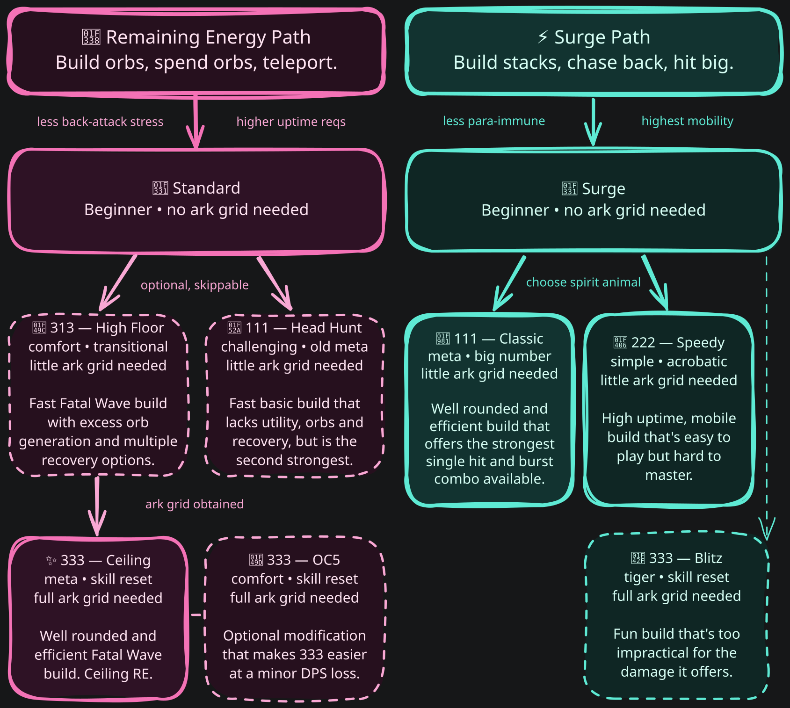

# Deathblade Class Guide

-   🌸 **Remaining Energy**

    ---

    Punishing but rewarding gameplay.

    [Get started →](remaining-energy/essentials.md)

-   ⚡ **Surge**

    ---

    Nimble repositioning for one massive hit.

    [Get started →](surge/essentials.md)

Note: DPS numbers and Surge guides have been built early for the upcoming update and do not reflect NA/EU servers yet.

---

**What do the build names mean?** Names like 333, 313, 111, and 222 are shorthand for each build's Ark Grid Core assignment, not a difficulty rating. Choose a build for more information.

## Additional Resources

*(Shared by both playstyles, see [Additional Resources](resources.md) for links, gearing tables, and bonus content.)*

---

**About:** This site adapts KR Deathblade research for NA. The class has enough quirks that the context behind it is worth knowing. It's easy to fork [this repo](https://github.com/interlockme/deathblade) and get a working site if you want your own spin.