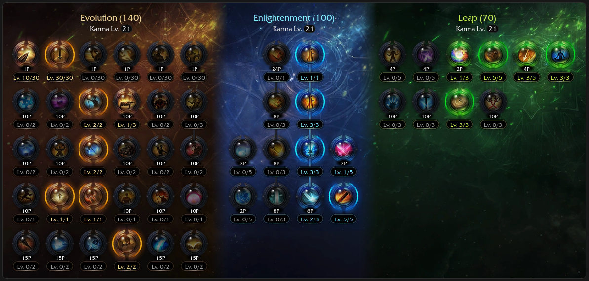
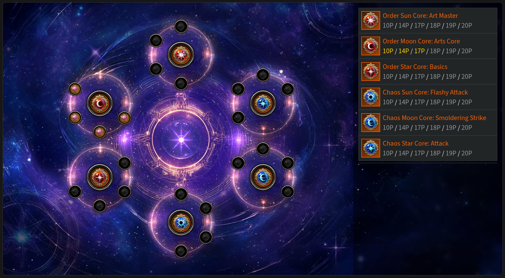
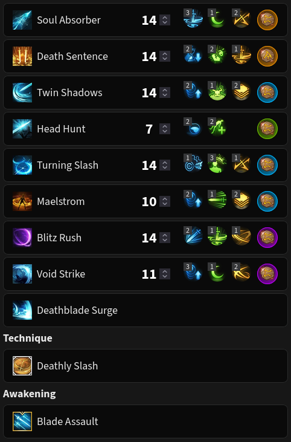
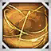
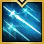
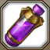
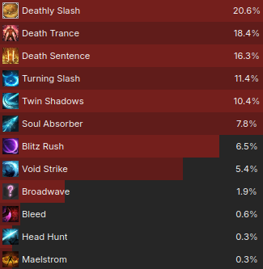

# 111 (Head Hunt) ⚠️

<div class="build-card" markdown>

<div class="build-stats">
<div class="stat"><span class="stat-label">Difficulty</span><span class="stat-value">9 / 10</span></div>
<div class="stat"><span class="stat-label">Trixion DPS</span><span class="stat-value">1.18 Multiplier</span></div>
<div class="stat"><span class="stat-label">Playstyle</span><span class="stat-value">Fast & Punishing</span></div>
</div>

**Best For:** Players who want maximum skill expression and speed.

**Tradeoff:** Unforgiving rotation with very little room for error.

- This is the final form of the old-school Remaining Energy gameplay.
- Head Hunt is used in the rotation, so it may not be available for recovery or counter.
- Similar rotation to Fatal Wave builds, but lower orb generation and fewer recovery options.

[NA Video Guide](https://www.youtube.com/watch?v=z8KE3HG_ggg){ .video-chip } [NA Video Gameplay](https://www.youtube.com/watch?v=4O9THIPhVuY){ .video-chip }

</div>

## Skill Codes

!!! danger "Before importing"
    Apply both "Ark Passive" and "Skill" to be safe. For [Gems](#gems), follow the guide.

=== "111 Head Hunt"

    ```
    C289D8EB08E331EA88A2C65A57DD383C979E48ABE184E47D357E8FB1E3E01A8DF959893AEA9B7713908581D63D17398B194369FAE09C50791B5BF3022A729D92
    ```

## Ark Setup




!!! tip ""
    Technically playable with zero Ark Grid investment, but not recommended.

!!! note "Adjustments"
    - Use the calculator you find easiest: [Arsonistic's](https://docs.google.com/spreadsheets/d/1_0J7liyM_yw16pyn6TKlF1YGaIt5n_A9hSoLnT3yTUc/edit?usp=sharing) or [KR's (Translated)](https://docs.google.com/spreadsheets/d/1RKpzg6sPNe7fuPDudJHAs0qbFukOwSyhMynDOijfoKY/edit?usp=sharing) to optimize Ark Passive.
        - Keen Sense 2 + Master is usually the best when using Keen Blunt Weapon.

## Skill Setup



!!! tip "Rune Adjustments"
    - Use Purify on Head Hunt if you must.

## Gems

<div class="gem-priority" markdown>

<div class="gem-col gem-col-dmg" markdown>
**Damage** — *Surge is most important.*

<div class="gem-row" markdown>
<span class="gem-chip"><span class="gem-num">1</span>  Surge</span>
<span class="gem-chip"><span class="gem-num">2</span>  Death Sentence</span>
<span class="gem-chip"><span class="gem-num">3</span>  Twin Shadows</span>
<span class="gem-chip"><span class="gem-num">4</span>  Turning Slash</span>
<span class="gem-chip"><span class="gem-num">5</span>  Soul Absorber</span>
<span class="gem-chip"><span class="gem-num">6</span>  Blitz Rush</span>
<span class="gem-chip"><span class="gem-num">7</span>  Void Strike</span>
</div>
</div>

<div class="gem-col gem-col-cd" markdown>
**Cooldown** — *Playable with Lv 7s, ideally Lv 8s or higher.*

<div class="gem-row" markdown>
<span class="gem-chip"><span class="gem-num">1</span>  Maelstrom</span>
<span class="gem-chip"><span class="gem-num">2</span>  Blitz Rush</span>
<span class="gem-chip"><span class="gem-num">3</span>  Head Hunt</span>
<span class="gem-chip"><span class="gem-num">4</span>  Turning Slash</span>
</div>
</div>

</div>

## Rotation

=== "Cycles"

    Use an **Opener**, then alternate between these two cycles as needed:

    **Cycle 1 — Void Strike + Deathly Slash**

    <div class="rotation-line" markdown>
    <span class="skill">Maelstrom</span><span class="arrow"> → </span><span class="skill">Void Strike</span><span class="arrow"> → </span><span class="skill">Twin Shadows</span><span class="arrow"> → </span><span class="skill">Head Hunt</span><span class="arrow"> → </span><span class="skill">Deathly Slash</span><span class="arrow"> → </span><span class="skill">Death Sentence</span><span class="arrow"> → </span><span class="skill">Turning Slash</span><span class="arrow"> → </span><span class="skill">Surge</span>
    </div>

    **Cycle 2 — Soul Absorber + Blitz Rush**

    <div class="rotation-line" markdown>
    <span class="skill">Soul Absorber</span><span class="arrow"> → </span><span class="skill">Blitz Rush</span><span class="arrow"> → </span><span class="skill">Twin Shadows</span><span class="arrow"> → </span><span class="skill">Death Sentence</span><span class="arrow"> → </span><span class="skill">Turning Slash</span><span class="arrow"> → </span><span class="skill">*(  Head Hunt — situational )*</span><span class="arrow"> → </span><span class="skill">Surge</span>
    </div>

    Aim to fit up to Cycle 2's Twin Shadows under Cycle 1's Maelstrom to reach 3 orbs without recasting or using recovery options. If you don't, an extra Head Hunt cast is required at the end of Cycle 2.

    Casting Head Hunt in Cycle 2 may force you to cast it at the end of the next Cycle 1, which creates minor downtime.

    Maelstrom management is extremely important when the rotation fails, you should cast it as it expires if needed.

    Due to limited orb generation, Turning Slash's after-effects have to carry over to the following cycle. Be quick!

    !!! warning ""
        Void Strike and Maelstrom only give full orb generation up close. Avoid walking by using mobility skills to get closer to the target — e.g. Maelstrom → Twin Shadows → Void Strike and adapt to changes in your rotation.

=== "Openers"

    Openers are meant to stack Adrenaline and apply synergies while dealing damage efficiently. If it all feels like too much to remember, just apply synergy and Surge, as that's the *minimum requirement* to start cycling.

    *From 3 orbs ({: .skill-icon } Stimulant):*

    <div class="rotation-line" markdown>
    <span class="skill">Head Hunt</span><span class="arrow"> ⇄ </span><span class="skill">Twin Shadows</span><span class="arrow"> → </span><span class="skill">Death Sentence</span><span class="arrow"> → </span><span class="skill">Maelstrom</span><span class="arrow"> → </span><span class="skill">Turning Slash</span><span class="arrow"> → </span><span class="skill">Deathly Slash</span><span class="arrow"> → </span><span class="skill">Surge</span><span class="arrow"> → </span><span class="skill">Blade Assault</span><span class="arrow"> → </span><span class="skill">Death Sentence</span><span class="arrow"> → </span><span class="skill">Turning Slash</span><span class="arrow"> → </span><span class="skill">Surge </span>
    </div>

    - Blade Assault is interchangeable with a regular Cycle 2 if it's on cooldown.
    - It's efficient to use {: .skill-icon } Atropine after Deathly Slash, with Blade Assault available.

    *From zero/partial orbs or extended raid downtime:*

    - Cycle 1 if Deathly Slash is off cooldown, otherwise start from Maelstrom + Cycle 2.

=== "Recovery"

    !!! example ""
        Watch this 54-minute [111 recovery video](https://www.youtube.com/watch?v=4478vFVX4VA) or consider an easier build.

    - Use spare Twin Shadows/Maelstrom stacks and/or Blitz Rush if you miss major skills.

??? example "Trixion DPS distribution (*Ancient cores, full Lv 10 gems*)"
    
