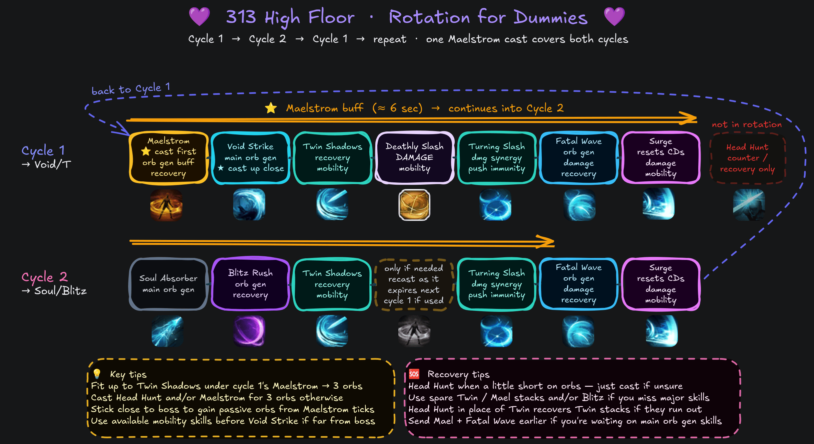

# 313 (High Floor) 💜

<div class="build-card-row" markdown>
<div class="build-card" data-updated="2026-08-07" markdown>

<!-- Difficulty/Trixion/Playstyle stats above, AND the pentagon badge below,
     both read from javascripts/build-data.js (window.DB_BUILD_DATA) - there is
     nothing to hand-edit in either div itself. Find this build by its
     data-build id there and edit pentagon/difficulty/trixion/bestFor/etc.;
     the stat row, the pentagon badge, and the essentials.md comparison table
     all update together from that one place. -->
<div class="build-stats" data-build="313-high-floor" data-family="re"></div>

**Best For:**{: .best-for } Players who want a simpler, faster, and more forgiving Fatal Wave build.

**Tradeoff:**{: .tradeoff } Lower damage ceiling, but easier to recover from mistakes.

- Head Hunt is always free for counters, recovery, purify, or Adrenaline upkeep.
- Accessible from a 14p Star core as 113 (Arts), a transitional core-limited option.
- Move on to [333 (Ceiling)](333-ceiling.md) when you're ready, or stay here if you prefer!

</div>
<div class="pentagon-badge" data-build="313-high-floor" data-family="re" markdown>
<div class="pentagon-badge-title">Build Profile</div>
<div class="pentagon-svg-mount"></div>
<div class="pentagon-badge-extra" markdown>
[Video Guide](https://www.youtube.com/watch?v=6ez2lS4AI6Q){ .video-chip }
</div>
</div>
</div>

## Skill Codes

<!-- Paste the exported skill-code string (from the in-game loadout share
     feature) into the fenced code block below. Each `=== "Tab Name"` block is
     a separate tab holding its own code + optional italic note above it -
     copy that pattern to add another import option (e.g. an easier variant). -->

<div class="setup-panel" data-accent="lavender" markdown>
<div class="setup-notes" markdown>

<details class="setup-note" data-kind="danger" open markdown>
<summary><span class="setup-note-tag">Warn</span>Before Importing<span class="setup-note-arrow"></span></summary>

Make sure you've read [Essentials](essentials.md), then apply both "Ark Passive" and "Skill" to be safe. For [Gems](#gems), follow the guide.

</details>

</div>
</div>

=== "313 High Floor ★"

    ```
    3C737E487FD0FDB67FEB883196135CED1CE05F2123097ECB878B14A177BFE26890DDBB5C6AE3B18CB34871BBE1E17D0CC47A0DAFAE4272BEA4FD33FCF57AF2FC
    ```

=== "113 Arts (core-limited)"

    *Requires either a Lv 9+ Fatal Wave CD gem or Optimized Training 1.*

    ```
    E3818904D40CEFE43FC30B0715D4EF6850C4E0C2183E48110767499D73BEC3831EBB750B31176844599B47B861C731968F30681780A45447FAD8F209D8D99517
    ```

## Ark Setup

<!-- ark-passives / ark-cores JSON below use the site-wide node/core id
     vocabulary - full schema (node ids, tier shape, points) is documented in
     javascripts/ark-passive-tree.js and ark-core-badge.js's "EASY EDIT GUIDE"
     comments. A nested "Alt" details block (e.g. an easier/optional variant)
     can carry its own compact ark-passives/skill-setup pair for that
     alternative - copy the existing pattern rather than editing the main
     tree in place. -->

<div class="setup-panel" data-accent="lavender" markdown>

<div class="ark-passives" data-family="re" markdown>
<script type="application/json">
[
    { "id": "evolution", "label": "Evolution", "points": 140, "tiers": [
      { "label": "Tier 1", "nodes": [
        { "id": "crit", "level": 10, "max": 30 },
        { "id": "specialization", "level": 30, "max": 30 }
      ] },
      { "label": "Tier 2", "nodes": [
        { "id": "keensense", "level": 2, "max": 2 },
        { "id": "limitbreakevo", "level": 1, "max": 3 }
      ] },
      { "label": "Tier 3", "nodes": [
        { "id": "strike", "level": 2, "max": 2 }
      ] },
      { "label": "Tier 4", "nodes": [
        { "id": "master", "level": 1, "max": 1 },
        { "id": "pulverize", "level": 1, "max": 1 }
      ] },
      { "label": "Tier 5", "nodes": [
        { "id": "standingstriker", "level": 2, "max": 2 }
      ] }
    ] },
    { "id": "enlightenment", "label": "Enlightenment", "points": 100, "tiers": [
      { "label": "Tier 1", "nodes": [
        { "id": "swiftstrike", "level": 1, "max": 1 }
      ] },
      { "label": "Tier 2", "nodes": [
        { "id": "remainingenergy", "level": 3, "max": 3 }
      ] },
      { "label": "Tier 3", "nodes": [
        { "id": "firmwill", "level": 3, "max": 3 }
      ] },
      { "label": "Tier 4", "nodes": [
        { "id": "extremebodymovement", "level": 3, "max": 3 },
        { "id": "orbcirculation", "level": 2, "max": 5 }
      ] }
    ] },
    { "id": "leap", "label": "Leap", "points": 70, "tiers": [
      { "label": "Tier 1", "nodes": [
        { "id": "unleashedpower", "level": 5, "max": 5 },
        { "id": "releasepotential", "level": 4, "max": 5 },
        { "id": "instantspell", "level": 2, "max": 3 }
      ] },
      { "label": "Tier 2", "nodes": [
        { "id": "danceofnightmares", "level": 3, "max": 3 }
      ] }
    ] }
  ]
</script>
</div>

<div class="ark-cores" data-family="re" markdown>
<script type="application/json">
[
  { "core": "sun", "label": "Levin Slash", "points": 3 },
  { "core": "moon", "label": "Arts Core", "points": 2 },
  { "core": "star", "label": "Death Sword Energy", "points": 2 }
]
</script>
</div>

<div class="setup-notes" markdown>

<details class="setup-note" data-kind="tip" open markdown>
<summary><span class="setup-note-tag">Tip</span>Ark Passive<span class="setup-note-arrow"></span></summary>

- Use the [Ark Passive Calculator](../resources.md#ark-passive-calculator) to optimize Evolution nodes.
- Release Potential 3 / Instant Spell 3 / Awakening Amplifier 1 can solve mana issues at a minor DPS loss.
    - Not as comfortable with +CD% bracelet line and/or low Specialization.

</details>

<details class="setup-note" data-kind="note" markdown>
<summary><span class="setup-note-tag">Note</span>Ark Grid<span class="setup-note-arrow"></span></summary>

- Raise Moon to 17p for increased QoL and damage when you can.

</details>

<details class="setup-note" data-kind="example" markdown>
<summary><span class="setup-note-tag">Alt</span>113 (Arts) core-limited<span class="setup-note-arrow"></span></summary>

<div class="ark-cores" data-family="re" markdown>
<script type="application/json">
[
  { "core": "sun", "label": "Art Master", "points": 0 },
  { "core": "moon", "label": "Arts Core", "points": 0 },
  { "core": "star", "label": "Death Sword Energy", "points": 2 }
]
</script>
</div>

- Same as 313 but **without** the Fatal Wave reset.
- Requires Lv 9+ Fatal Wave CD gem or Optimized Training Lv 1.
    - Avoid +CD% bracelet line for this core-limited variant.
    - Check gem section to see which gems to replace from 313.

</details>

</div>

</div>

## Skill Setup

<!-- Full skill-setup schema (id/level/tripods/rune/subtitle/picks) is in
     javascripts/skill-setup.js's "EASY EDIT GUIDE" comment. Names, icons, and
     tags resolve automatically by id from skill-data.js - only add "name" to
     override the display text for a genuine one-off case. -->

<div class="setup-panel" data-accent="lavender" markdown>

<div class="skill-setup" data-family="re" markdown>
<script type="application/json">
[
  {"id": "soulabsorber", "level": 14, "tripods": [3, 1, 2], "rune": {"tier": "epic", "name": "Wealth"}},
  {"id": "twinshadows", "level": 14, "tripods": [2, 1, 2], "rune": {"tier": "blue", "name": "Wealth"}},
  {"id": "headhunt", "level": 7, "tripods": [1, 2], "rune": {"tier": "legendary", "name": "Focus"}},
  {"id": "turningslash", "level": 14, "tripods": [1, 3, 1], "rune": {"tier": "blue", "name": "Wealth"}},
  {"id": "maelstrom", "level": 10, "tripods": [2, 1, 2], "rune": {"tier": "green", "name": "Wealth"}},
  {"id": "fatalwave", "level": 14, "tripods": [1, 3, 2], "rune": {"tier": "legendary", "name": "Wealth"}},
  {"id": "blitzrush", "level": 14, "tripods": [2, 1, 1], "rune": {"tier": "blue", "name": "Wealth"}},
  {"id": "voidstrike", "level": 11, "tripods": [3, 1, 2], "rune": {"tier": "epic", "name": "Wealth"}},
  {"id": "surge", "subtitle": "Identity"},
  {"id": "deathlyslash", "subtitle": "Technique"},
  {"id": "bladeassault", "subtitle": "Awakening"}
]
</script>
</div>

<div class="setup-notes" markdown>

<details class="setup-note" data-kind="tip" open markdown>
<summary><span class="setup-note-tag">Tip</span>Runes<span class="setup-note-arrow"></span></summary>

- Use Legendary Galewind, Purify or green Wealth on Head Hunt if you have no mana issues.
- Legendary Focus on Maelstrom can solve major mana issues at a minor loss of orb generation.

</details>

<details class="setup-note" data-kind="note" markdown>
<summary><span class="setup-note-tag">Note</span>Optional<span class="setup-note-arrow"></span></summary>

- You can bring Head Hunt down to Lv 1 and Void Strike up to Lv 14 for +0.5% DPS and lower mana use.
    - However, Lv 7 is more practical and makes recovery much easier and faster. ★
    - At Lv 7, Magick Control tripod can help solve mana issues if you don't need the CDR.
    - Lv 4 Head Hunt (Quick Prep) with Void Strike Lv 13 is a decent overall compromise.

</details>

<details class="setup-note" data-kind="danger" markdown>
<summary><span class="setup-note-tag">Warn</span>Balance Patch<span class="setup-note-arrow"></span></summary>

- Swift Fingers **may** become the default 1st row tripod for Blitz Rush.
    - ~2% DPS loss but CPM and playability increases may make up for it.
    - Void Strike is raised to Lv 13 and Blitz Rush is lowered to Lv 12.
    - Gem priority of Void Strike and Blitz Rush is swapped.
- Needs live testing, 313 is so fast that it might not benefit fully.
- See [Essentials](essentials.md) for class-wide changes.

</details>

</div>

</div>

## Gems

<!-- Ranked skill-id lists per column (dmg/cd), top = highest priority.
     Full schema, including the expandable "alts" form for a swappable
     alternative, is in javascripts/gem-priority.js's "EASY EDIT GUIDE"
     comment. -->

<div class="setup-panel" data-accent="lavender" markdown>

<div class="gem-priority" markdown>
<script type="application/json">
[
  { "col": "dmg", "label": "Damage", "items": [
    "surge", "fatalwave", "twinshadows", "soulabsorber",
    "turningslash", "blitzrush", "voidstrike"
  ] },
  { "col": "cd", "label": "Cooldown", "items": [
    "maelstrom",
    "turningslash",
    { "id": "soulabsorber", "alts": [
      { "id": "blitzrush", "note": "Faster recovery from smaller mistakes, pairs with Twin Shadows or Fatal Wave below." }
    ] },
    { "id": "voidstrike", "alts": [
      { "id": "twinshadows", "note": "Pairs with Blitz Rush above for the skilled-player recovery route." },
      { "id": "fatalwave", "note": "Required for 113 (Arts) or when sharing gems with 333 (Ceiling), pairs with Blitz Rush." }
    ] }
  ] }
]
</script>
</div>

</div>

## Rotation

<!-- Each `.rotation-line` is a compact JSON step list of skill ids in
     order - names/icons resolve automatically, same id vocabulary as Skill
     Setup and Gems above. Full schema (situational steps, swapNext,
     cycleRef, trailing suffix, etc.) is in javascripts/rotation-line.js's
     "EASY EDIT GUIDE" comment. -->

=== "Cycles"

    Use an **Opener**, then alternate between these two cycles as needed:

    <div class="cycle-card" markdown>
    <div class="cycle-card-header"><span class="cycle-num cycle-num-1">1</span><span class="cycle-title">Void Strike + Deathly Slash</span></div>
    <div class="rotation-line" markdown>
    <script type="application/json">
    ["maelstrom", "voidstrike", "twinshadows", "deathlyslash", "turningslash", "fatalwave", "surge"]
    </script>
    </div>
    </div>

    <div class="cycle-card" markdown>
    <div class="cycle-card-header"><span class="cycle-num cycle-num-2">2</span><span class="cycle-title">Soul Absorber + Blitz Rush</span></div>
    <div class="rotation-line" markdown>
    <script type="application/json">
    ["soulabsorber", "blitzrush", "twinshadows",
     { "id": "maelstrom", "situational": true },
     "turningslash", "fatalwave", "surge"]
    </script>
    </div>
    </div>

    Aim to fit up to Cycle **2**'s Twin Shadows under Cycle **1**'s Maelstrom to reach 3 orbs without recasting or using recovery options. If you only landed up to Soul Absorber, an extra Head Hunt cast is usually enough.

    The Maelstrom in Cycle **2** is only cast if you'd otherwise miss 3 orbs. Use your judgment. If cast, it lasts at least until Cycle **1**'s Void Strike; recasting it as it expires aligns cooldowns. If it wasn't needed or it didn't last, nothing changes.

=== "Openers"

    Openers stack Adrenaline and apply synergies efficiently. If it feels overwhelming, just apply synergy and Surge at full orbs; that's all you need to start the alternating cycles.

    *From 3 orbs ({: .skill-icon } Stimulant):*
    { .lead }

    <div class="rotation-line" markdown>
    <script type="application/json">
    [{ "id": "headhunt", "swapNext": true }, "twinshadows", "maelstrom", "turningslash", "deathlyslash", "surge",
     { "cycleRef": 2, "title": "Soul Absorber + Blitz Rush Cycle" },
     { "cycleRef": 1, "title": "Void Strike + Deathly Slash Cycle" },
     { "suffix": "etc." }]
    </script>
    </div>

    - <span class="skill-chip">Blade Assault</span> is interchangeable with Cycle **2** if it's available.
    - It's efficient to use {: .skill-icon } Atropine after Deathly Slash, with Blade Assault available.

    *From zero/partial orbs:*
    { .lead }

    - Cycle **1** if Deathly Slash is available, otherwise start from Maelstrom + Cycle **2**.
    - Prioritize Turning Slash earlier for synergy and Deathly Slash last for Adrenaline/RE buff.

=== "Recovery"

    <div class="setup-panel" data-accent="lavender" markdown>
    <div class="setup-notes" markdown>

    <details class="setup-note" data-kind="tip" open markdown>
    <summary><span class="setup-note-tag">Tip</span>Recovery Video<span class="setup-note-arrow"></span></summary>

    Watch this 2-minute [333 recovery video](https://www.youtube.com/watch?v=4478vFVX4VA) and read the segment titles.

    </details>

    </div>
    </div>

    - 313 plays similarly, just Turning Slash → Fatal Wave instead of FTF.
    - Use <span class="skill-chip">Head Hunt</span> when a little short on orbs, just cast if unsure.
    - Use spare Twin Shadows/Maelstrom stacks and/or Blitz Rush if you miss major skills.
    - Use <span class="skill-chip">Head Hunt</span> instead of <span class="skill-chip">Twin Shadows</span> for a cycle to recover stacks if they run out.
    - Use Maelstrom + Fatal Wave earlier if waiting on main orb generation skills.

=== "TL;DR:"
    { .zoomable-image loading=lazy }

## DPS Spread

<!-- data-labels / data-values / data-ids are three parallel comma-separated
     lists, ordered highest % first - update after a fresh Trixion recording
     or a balance pass. Full schema is in javascripts/dps-chart.js's
     "EASY EDIT GUIDE" comment. -->

<p class="dps-showcase-caption">Ancient cores, full Lv 10 gems</p>

<div class="dps-showcase" markdown>
<div class="dps-showcase-frame" markdown>
<div class="dps-chart" data-show-icons data-labels="Deathly Slash,Fatal Wave,Surge,Twin Shadows,Soul Absorber,Turning Slash,Blitz Rush,Void Strike,Bleed,Maelstrom" data-values="20.9,20.7,19.1,9.5,8.5,8,6.9,5.5,0.6,0.3" data-ids="deathlyslash,fatalwave,surge,twinshadows,soulabsorber,turningslash,blitzrush,voidstrike,bleed,maelstrom"></div>
</div>
</div>