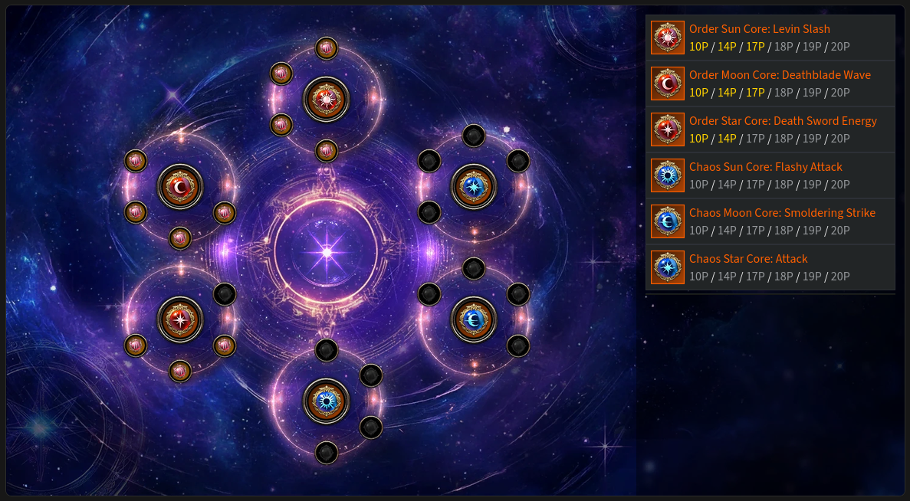
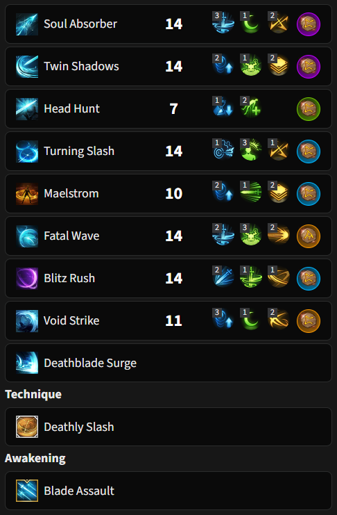
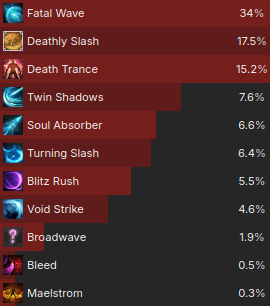

# 333 (Ceiling) ✨

<div class="build-card" markdown>

<div class="build-stats">
<div class="stat"><span class="stat-label">Difficulty</span><span class="stat-value">8.5 / 10</span><div class="stat-bar-track"><div class="stat-bar-fill" style="width: 85%"></div></div></div>
<div class="stat"><span class="stat-label">Trixion DPS</span><span class="stat-value">1.20 Multiplier</span><div class="stat-bar-track stat-bar-track-teal"><div class="stat-bar-fill stat-bar-fill-teal" style="width: 67%"></div></div></div>
<div class="stat"><span class="stat-label">Playstyle</span><span class="stat-value">Skill Reset</span></div>
</div>

**Best For:**{: .best-for } Players who want the highest damage Fatal Wave build.

**Tradeoff:**{: .tradeoff } Lower orb generation and a less forgiving rotation.

- Uses Fatal Wave as two fast casts (FTF combo) via a skill reset.
- Head Hunt is always free for counters, recovery, purify, or Adrenaline upkeep.
- High gem efficiency, Fatal Wave and Deathly Slash are most of your DPS.
- Susceptible to high ping or low FPS, but you can compensate with a few changes.

[KR Video Guide](https://youtu.be/Wwm7apTwg84?si=dmO_fvNxoXuoQuf5){ .video-chip } [KR Video Gameplay](https://www.youtube.com/watch?v=MP--TuRX3xI){ .video-chip }

</div>

## Skill Codes

!!! danger "Before importing"
    Make sure you've read [Essentials](essentials.md), then apply both "Ark Passive" and "Skill" to be safe. For [Gems](#gems), follow the guide.

=== "333 Ceiling ★"

    ```
    8996BED713426C25CB993BCA48EB9CBA2BF93921A91CAA15F463DED8BF367B2AF73535AAC800498B7340CA45735567DFFAA91A4914C7B288362130D9E34634CC
    ```

=== "Orb Circulation 5 (easier)"

    *This is ~3% weaker but more forgiving to play. It uses Legendary Wealth on Soul Absorber as well.*

    ```
    D4D17B7F291340AAD2E9831A065E7F9870B3612FFA798E77FC1FFEE9E4D68E400597FDB2A3DCAA11D5DB53B85812DF1042A685249158B4E08BB87A614E428350
    ```

## Ark Setup




!!! tip ""
    The minimum requirement is shown above. Finish up Star to 17p when you can.

!!! note "Adjustments"
    - Use the calculator you find easiest: [Arsonistic's](https://docs.google.com/spreadsheets/d/1_0J7liyM_yw16pyn6TKlF1YGaIt5n_A9hSoLnT3yTUc/edit?usp=sharing) or [KR's (Translated)](https://docs.google.com/spreadsheets/d/1RKpzg6sPNe7fuPDudJHAs0qbFukOwSyhMynDOijfoKY/edit?usp=sharing) to optimize Ark Passive.
        - Keen Sense 2 + Master is usually best when using Keen Blunt Weapon.
    - Release Potential 3 / Instant Spell 3 / Awakening Amplifier 1 can solve mana issues at a very minor DPS loss.
        - Not as comfortable with +CD% bracelet line and/or low Specialization.

??? example "Alternative Enlightenment setup: Orb Circulation 5"
    - Extreme Body Movement 2, Orb Circulation 5, Swordcraft Enhancement 1 can make this build more forgiving at a ~3% DPS loss. Try giving Soul Absorber the Legendary Wealth rune if you use this!

## Skill Setup



!!! tip "Rune Adjustments"
    - Use Legendary Galewind, Focus or Purify on Head Hunt if you prefer.
    - Legendary Galewind on Blitz Rush is *viable* if you're very skilled.
        - Uptime and skill requirement are both increased; this is NOT recommended.
        - Give Head Hunt a blue Wealth and change Blitz Rush CD gem to Twin Shadows.

??? note "Skill Adjustments"
    - You can bring Head Hunt down to Lv 1 and Void Strike up to Lv 14 for +0.4% DPS and lower mana use.
        - However, Lv 7 is more practical and makes recovery much easier and faster. ★
        - At Lv 7, Magick Control tripod can help solve mana issues if you don't need the CDR.
        - Lv 4 Head Hunt (Quick Prep) with Void Strike Lv 13 is a decent overall compromise.

??? danger "Upcoming Balance Patch (September) — build-specific changes"
    - Swift Fingers will become the default 1st row tripod for Blitz Rush.
        - ~1.5% DPS loss but CPM and playability increases make up for it.
        - Void Strike is raised to Lv 13 and Blitz Rush is lowered to Lv 12.
        - Gem priority of Void Strike and Blitz Rush is swapped.
    - Apply changes manually if the guide is not updated in time.
    - See [Essentials](essentials.md) for class-wide changes.

??? danger "Alternative rune setup *(for lazy alts, high latency, slow hands, etc)*"
    Wealth on Fatal Wave can make this build more forgiving at a ~4% DPS loss. It won't cycle as smoothly, but the reduced stress and urgency may suit some playstyles. Consider playing Surge instead of this.

    | Skill | Rune |
    |---|---|
    | Fatal Wave | Epic Wealth |
    | Void Strike | Epic Wealth |
    | Soul Absorber | Legendary Wealth |
    | Twin Shadows | Blue Wealth |
    | Maelstrom | Green Wealth |
    | Leap Ark | Release Potential 3 / Instant Spell 3 |

## Gems

<div class="gem-priority" markdown>

<div class="gem-col gem-col-dmg" markdown>
**Damage** — *Fatal Wave is most important.*

<div class="gem-row" markdown>
<span class="gem-chip"><span class="gem-num">1</span>  Fatal Wave</span>
<span class="gem-chip"><span class="gem-num">2</span>  Surge</span>
<span class="gem-chip"><span class="gem-num">3</span>  Twin Shadows</span>
<span class="gem-chip"><span class="gem-num">4</span>  Soul Absorber</span>
<span class="gem-chip"><span class="gem-num">5</span>  Turning Slash</span>
<span class="gem-chip"><span class="gem-num">6</span>  Blitz Rush</span>
<span class="gem-chip"><span class="gem-num">7</span>  Void Strike</span>
</div>
</div>

<div class="gem-col gem-col-cd" markdown>
**Cooldown** — *Playable with Lv 7s, ideally Lv 8s or higher.*

<div class="gem-row" markdown>
<span class="gem-chip"><span class="gem-num">1</span>  Maelstrom</span>
<span class="gem-chip"><span class="gem-num">2</span>  Blitz Rush</span>
<span class="gem-chip"><span class="gem-num">3</span>  Turning Slash</span>
<span class="gem-chip"><span class="gem-num">4</span>  Fatal Wave</span>
</div>
</div>

</div>

You can share this gem setup with [313 (High Floor)](313-high-floor.md) and 113 (Arts) alts if needed.

## Rotation

=== "Cycles"

    Use an **Opener**, then alternate between these two cycles as needed:

    <div class="cycle-card" markdown>
    <div class="cycle-card-header"><span class="cycle-num">1</span><span class="cycle-title">Void Strike + Deathly Slash</span></div>
    <div class="rotation-line" markdown>
    <span class="skill">Maelstrom</span><span class="arrow"> → </span><span class="skill">Void Strike</span><span class="arrow"> → </span><span class="skill">Twin Shadows</span><span class="arrow"> → </span><span class="skill">Deathly Slash</span><span class="arrow"> → </span><span class="skill">Fatal Wave</span><span class="arrow"> → </span><span class="skill">Turning Slash</span><span class="arrow"> → </span><span class="skill">Fatal Wave</span><span class="arrow"> → </span><span class="skill">Surge</span>
    </div>
    </div>

    <div class="cycle-card" markdown>
    <div class="cycle-card-header"><span class="cycle-num">2</span><span class="cycle-title">Soul Absorber + Blitz Rush</span></div>
    <div class="rotation-line" markdown>
    <span class="skill">Soul Absorber</span><span class="arrow"> → </span><span class="skill">Blitz Rush</span><span class="arrow"> → </span><span class="skill">Twin Shadows</span><span class="arrow"> → </span><span class="skill">*(  Maelstrom — situational )*</span><span class="arrow"> → </span><span class="skill">Fatal Wave</span><span class="arrow"> → </span><span class="skill">Turning Slash</span><span class="arrow"> → </span><span class="skill">Fatal Wave</span><span class="arrow"> → </span><span class="skill">Surge</span>
    </div>
    </div>

    Aim to fit up to Cycle 2's Twin Shadows under Cycle 1's Maelstrom to reach 3 orbs without recasting or using recovery options. If you only landed up to Soul Absorber, an extra Head Hunt cast is usually enough.

    The Maelstrom in Cycle 2 is only cast if you'd otherwise miss 3 orbs. Use your judgment. If cast, it lasts at least until Cycle 1's Void Strike; recasting it as it expires aligns cooldowns. If it wasn't needed or it didn't last, nothing changes.

    !!! warning ""
        Void Strike and Maelstrom only give full orb generation up close. Avoid walking by using mobility skills to get closer to the target — e.g. Maelstrom → Twin Shadows → Void Strike and adapt to changes in your rotation.

=== "Openers"

    Openers stack Adrenaline and apply synergies efficiently. If it feels overwhelming, just apply synergy and Surge at full orbs; that's all you need to start the alternating cycles.

    *From 3 orbs ({: .skill-icon } Stimulant):*
    { .lead }

    <div class="rotation-line" markdown>
    <span class="skill">Head Hunt</span><span class="arrow"> ⇄ </span><span class="skill">Twin Shadows</span><span class="arrow"> → </span><span class="skill">Maelstrom</span><span class="arrow"> → </span><span class="skill">Turning Slash</span><span class="arrow"> → </span><span class="skill">Deathly Slash</span><span class="arrow"> → </span><span class="skill">Fatal Wave</span><span class="arrow"> → </span><span class="skill">Surge</span><span class="arrow"> → </span><span class="skill"><span class="cycle-num">2</span><span class="cycle-title">Soul Absorber + Blitz Rush Cycle</span></span><span class="arrow"> → </span><span class="skill"><span class="cycle-num">1</span><span class="cycle-title">Void Strike + Deathly Slash Cycle</span></span><span class="arrow"> → etc. </span>
    </div>

    - <span class="skill-chip">Blade Assault</span> + <span class="skill-chip">FTF</span> is interchangeable with Cycle 2 if it's available.
    - It's efficient to use {: .skill-icon } Atropine after Deathly Slash, with Blade Assault available.

    *From zero/partial orbs:*
    { .lead }

    - Cycle 1 if Deathly Slash is off cooldown, otherwise start from Maelstrom + Cycle 2.
    - Prioritize the FTF combo earlier for better party synergy uptime.

=== "Recovery"

    !!! example ""
        Watch this 2-minute [333 recovery video](https://www.youtube.com/watch?v=4478vFVX4VA) and read the segment titles.

    - Use Head Hunt when a little short on orbs, just cast if unsure.
    - Use spare Twin Shadows/Maelstrom stacks and/or Blitz Rush if you miss major skills.
    - Use Head Hunt instead of Twin Shadows for a cycle to recover stacks if they run out.
    - Use Maelstrom + FTF combo earlier if waiting on main orb generation skills.
    - Hold Deathly Slash until next Cycle 1 if it's out of sync. Not optimal, but simpler.

=== "TL;DR:"
    

??? example "Trixion DPS distribution (*Ancient cores, full Lv 10 gems*)"
    