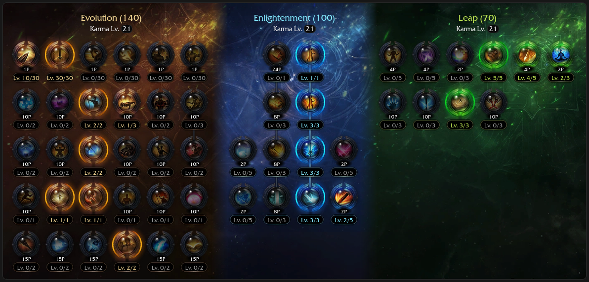
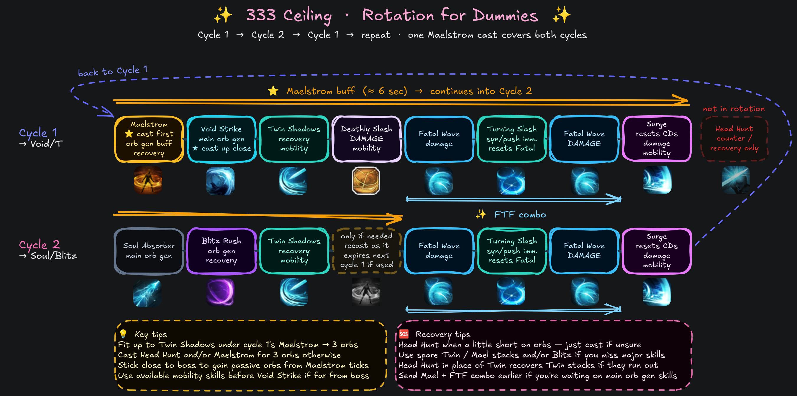

# 333 (Ceiling) ✨

<div class="build-card-row" markdown>
<div class="build-card" data-updated="2026-08-07" markdown>

<div class="build-stats">
<div class="stat"><span class="stat-label">Difficulty</span><span class="stat-value">8.5 / 10</span><div class="stat-bar-track"><div class="stat-bar-fill" style="width: 85%"></div></div></div>
<div class="stat"><span class="stat-label">Trixion DPS</span><span class="stat-value">1.20 Multiplier</span><div class="stat-bar-track stat-bar-track-teal"><div class="stat-bar-fill stat-bar-fill-teal" style="width: 67%"></div></div></div>
<div class="stat"><span class="stat-label">Playstyle</span><span class="stat-value">Skill Reset</span></div>
</div>

**Best For:**{: .best-for } Players who want the highest damage RE build.

**Tradeoff:**{: .tradeoff } Slightly lower orb generation and a less forgiving rotation.

- Uses Fatal Wave as two fast casts (FTF combo) via a skill reset.
- Head Hunt is always free for counters, recovery, purify, or Adrenaline upkeep.
- High gem efficiency, Fatal Wave and Deathly Slash are most of your DPS.
- Susceptible to high ping or low FPS, but you can compensate with a few changes.

</div>
<!-- Build profile pentagon. Order: Difficulty, DPS, Mobility, Recovery, Speed (0-10).
     - Difficulty/DPS match the stat boxes above (DPS here is RE's highest
       -> 9, this is the family's reference build for that scale).
     - Mobility 5 is standard across all RE builds.
     - Recovery/Speed are this build's own read - edit freely.
     See javascripts/pentagon-badge.js top comment for the full scale writeup. -->
<div class="pentagon-badge" data-build="333-ceiling" data-family="re" markdown>
<div class="pentagon-badge-title">Build Profile</div>
<div class="pentagon-svg-mount"></div>
<div class="pentagon-badge-extra" markdown>
[KR Video Guide](https://youtu.be/Wwm7apTwg84?si=dmO_fvNxoXuoQuf5){ .video-chip } [Video Gameplay](https://www.youtube.com/watch?v=MP--TuRX3xI){ .video-chip }
</div>
</div>
</div>

## Skill Codes

!!! danger "Before importing"
    Make sure you've read [Essentials](essentials.md), then apply both "Ark Passive" and "Skill" to be safe. For [Gems](#gems), follow the guide.

=== "333 Ceiling ★"

    ```
    8996BED713426C25CB993BCA48EB9CBA2BF93921A91CAA15F463DED8BF367B2AF73535AAC800498B7340CA45735567DFFAA91A4914C7B288362130D9E34634CC
    ```

=== "Orb Circulation 5 (easier)"

    *This is ~3% weaker but more forgiving to play. It uses Legendary Wealth on Soul Absorber as well.*

    ```
    D4D17B7F291340AAD2E9831A065E7F9870B3612FFA798E77FC1FFEE9E4D68E400597FDB2A3DCAA11D5DB53B85812DF1042A685249158B4E08BB87A614E428350
    ```

## Ark Setup



<div class="setup-panel" data-accent="pink" markdown>

<div class="ark-cores" data-family="re" markdown>
<script type="application/json">
[
  { "core": "sun", "label": "Levin Slash", "points": 3 },
  { "core": "moon", "label": "Deathblade Wave", "points": 3 },
  { "core": "star", "label": "Death Sword Energy", "points": 2 }
]
</script>
</div>

<div class="setup-notes" markdown>

<details class="setup-note" data-kind="tip" open markdown>
<summary><span class="setup-note-tag">Tip</span>Ark Passive<span class="setup-note-arrow"></span></summary>

- Use the [Ark Passive Calculator](../resources.md#ark-passive-calculator) to optimize Evolution nodes.
- Release Potential 3 / Instant Spell 3 / Awakening Amplifier 1 can solve mana issues at a very minor DPS loss.
    - Not as comfortable with +CD% bracelet line and/or low Specialization.

</details>

<details class="setup-note" data-kind="note" open markdown>
<summary><span class="setup-note-tag">Note</span>Ark Grid<span class="setup-note-arrow"></span></summary>

- Finish up Star to 17p when you can, Fatal Wave is your highest damage skill.

</details>

<details class="setup-note" data-kind="example" markdown>
<summary><span class="setup-note-tag">Alternative</span>Orb Circulation 5<span class="setup-note-arrow"></span></summary>

- Set Enlightenment to Extreme Body Movement 2, Orb Circulation 5, Swordcraft Enhancement 1.
    - Makes this build more forgiving at a ~3% DPS loss by increasing passive orb generation.
    - Try giving Soul Absorber the Legendary Wealth rune if you run this for an even easier Cycle 2!

</details>

</div>

</div>

## Skill Setup

<div class="setup-panel" data-accent="lavender" markdown>

<div class="skill-setup" data-family="re" markdown>
<script type="application/json">
[
  {"id": "soulabsorber", "name": "Soul Absorber", "level": 14, "tripods": [3, 1, 2], "rune": {"tier": "epic", "name": "Wealth"}},
  {"id": "twinshadows", "name": "Twin Shadows", "level": 14, "tripods": [2, 1, 2], "rune": {"tier": "epic", "name": "Wealth"}},
  {"id": "headhunt", "name": "Head Hunt", "level": 7, "tripods": [1, 2], "rune": {"tier": "green", "name": "Wealth"}},
  {"id": "turningslash", "name": "Turning Slash", "level": 14, "tripods": [1, 3, 1], "rune": {"tier": "blue", "name": "Wealth"}},
  {"id": "maelstrom", "name": "Maelstrom", "level": 10, "tripods": [2, 1, 2], "rune": {"tier": "blue", "name": "Wealth"}},
  {"id": "fatalwave", "name": "Fatal Wave", "level": 14, "tripods": [2, 3, 2], "rune": {"tier": "legendary", "name": "Galewind"}},
  {"id": "blitzrush", "name": "Blitz Rush", "level": 14, "tripods": [2, 1, 1], "rune": {"tier": "blue", "name": "Wealth"}},
  {"id": "voidstrike", "name": "Void Strike", "level": 11, "tripods": [3, 1, 2], "rune": {"tier": "legendary", "name": "Wealth"}},
  {"id": "surge", "name": "Deathblade Surge", "subtitle": "Identity"},
  {"id": "deathlyslash", "name": "Deathly Slash", "subtitle": "Technique"},
  {"id": "bladeassault", "name": "Blade Assault", "subtitle": "Awakening"}
]
</script>
</div>

<div class="setup-notes" markdown>

<details class="setup-note" data-kind="tip" open markdown>
<summary><span class="setup-note-tag">Tip</span>Runes<span class="setup-note-arrow"></span></summary>

- Use Legendary Galewind, Focus or Purify on Head Hunt if you prefer.

</details>

<details class="setup-note" data-kind="note" markdown>
<summary><span class="setup-note-tag">Note</span>Optional<span class="setup-note-arrow"></span></summary>

- You can bring Head Hunt down to Lv 1 and Void Strike up to Lv 14 for +0.4% DPS and lower mana use.
    - However, Lv 7 is more practical and makes recovery much easier and faster. ★
    - At Lv 7, Magick Control tripod can help solve mana issues if you don't need the CDR.
    - Lv 4 Head Hunt (Quick Prep) with Void Strike Lv 13 is a decent overall compromise.

</details>

<details class="setup-note" data-kind="example" markdown>
<summary><span class="setup-note-tag">Alternative</span>Fatal Wealth<span class="setup-note-arrow"></span></summary>

- Wealth rune on Fatal Wave can make this build more forgiving at a ~4% DPS loss.
    - It won't cycle as smoothly, but the reduced stress and urgency may suit some people.
    - Consider playing Surge instead of this or any build with Fatal Wave Orb Control tripod.

    | Skill | Rune |
    |---|---|
    | Fatal Wave | Epic Wealth |
    | Void Strike | Epic Wealth |
    | Soul Absorber | Legendary Wealth |
    | Twin Shadows | Blue Wealth |
    | Maelstrom | Green Wealth |
    | Leap Ark | Release Potential 3 / Instant Spell 3 |

</details>

<details class="setup-note" data-kind="danger" markdown>
<summary><span class="setup-note-tag">Warning</span>Balance Patch<span class="setup-note-arrow"></span></summary>

- Swift Fingers will become the default 1st row tripod for Blitz Rush.
    - ~1.5% DPS loss but CPM and playability increases make up for it.
    - Void Strike is raised to Lv 13 and Blitz Rush is lowered to Lv 12.
    - Gem priority of Void Strike and Blitz Rush is swapped.
- Apply changes manually if the guide is not updated in time.
- See [Essentials](essentials.md) for class-wide changes.

</details>

</div>

</div>

## Gems

<div class="gem-priority" markdown>

<div class="gem-col gem-col-dmg" markdown>
**Damage** — *Fatal Wave is most important.*

<div class="gem-row" markdown>
<span class="gem-chip"><span class="gem-num">1</span>  Fatal Wave</span>
<span class="gem-chip"><span class="gem-num">2</span>  Surge</span>
<span class="gem-chip"><span class="gem-num">3</span>  Twin Shadows</span>
<span class="gem-chip"><span class="gem-num">4</span>  Soul Absorber</span>
<span class="gem-chip"><span class="gem-num">5</span>  Turning Slash</span>
<span class="gem-chip"><span class="gem-num">6</span>  Blitz Rush</span>
<span class="gem-chip"><span class="gem-num">7</span>  Void Strike</span>
</div>
</div>

<div class="gem-col gem-col-cd" markdown>
**Cooldown** — *Playable with Lv 7s, ideally Lv 8s or higher.*

<div class="gem-row" markdown>
<span class="gem-chip"><span class="gem-num">1</span>  Maelstrom</span>
<span class="gem-chip"><span class="gem-num">2</span>  Blitz Rush</span>
<span class="gem-chip"><span class="gem-num">3</span>  Turning Slash</span>
<span class="gem-chip"><span class="gem-num">4</span>  Fatal Wave</span>
</div>
</div>

</div>

You can share this gem setup with [313 (High Floor)](313-high-floor.md) and 113 (Arts) alts if needed.

## Rotation

=== "Cycles"

    Use an **Opener**, then alternate between these two cycles as needed:

    <div class="cycle-card" markdown>
    <div class="cycle-card-header"><span class="cycle-num">1</span><span class="cycle-title">Void Strike + Deathly Slash</span></div>
    <div class="rotation-line" markdown>
    <span class="skill">Maelstrom</span><span class="arrow"> → </span><span class="skill">Void Strike</span><span class="arrow"> → </span><span class="skill">Twin Shadows</span><span class="arrow"> → </span><span class="skill">Deathly Slash</span><span class="arrow"> → </span><span class="skill">Fatal Wave</span><span class="arrow"> → </span><span class="skill">Turning Slash</span><span class="arrow"> → </span><span class="skill">Fatal Wave</span><span class="arrow"> → </span><span class="skill">Surge</span>
    </div>
    </div>

    <div class="cycle-card" markdown>
    <div class="cycle-card-header"><span class="cycle-num">2</span><span class="cycle-title">Soul Absorber + Blitz Rush</span></div>
    <div class="rotation-line" markdown>
    <span class="skill">Soul Absorber</span><span class="arrow"> → </span><span class="skill">Blitz Rush</span><span class="arrow"> → </span><span class="skill">Twin Shadows</span><span class="arrow"> → </span><span class="skill skill-situational">Maelstrom<span class="skill-situational-tag">situational</span></span><span class="arrow"> → </span><span class="skill">Fatal Wave</span><span class="arrow"> → </span><span class="skill">Turning Slash</span><span class="arrow"> → </span><span class="skill">Fatal Wave</span><span class="arrow"> → </span><span class="skill">Surge</span>
    </div>
    </div>

    Aim to fit up to Cycle **2**'s Twin Shadows under Cycle **1**'s Maelstrom to reach 3 orbs without recasting or using recovery options. If you only landed up to Soul Absorber, an extra Head Hunt cast is usually enough.

    The Maelstrom in Cycle **2** is only cast if you'd otherwise miss 3 orbs. Use your judgment. If cast, it lasts at least until Cycle **1**'s Void Strike; recasting it as it expires aligns cooldowns. If it wasn't needed or it didn't last, nothing changes.

=== "Openers"

    Openers stack Adrenaline and apply synergies efficiently. If it feels overwhelming, just apply synergy and Surge at full orbs; that's all you need to start the alternating cycles.

    *From 3 orbs ({: .skill-icon } Stimulant):*
    { .lead }

    <div class="rotation-line" markdown>
    <span class="skill">Head Hunt</span><span class="arrow"> ⇄ </span><span class="skill">Twin Shadows</span><span class="arrow"> → </span><span class="skill">Maelstrom</span><span class="arrow"> → </span><span class="skill">Turning Slash</span><span class="arrow"> → </span><span class="skill">Deathly Slash</span><span class="arrow"> → </span><span class="skill">Fatal Wave</span><span class="arrow"> → </span><span class="skill">Surge</span><span class="arrow"> → </span><span class="skill"><span class="cycle-num">2</span><span class="cycle-title">Soul Absorber + Blitz Rush Cycle</span></span><span class="arrow"> → </span><span class="skill"><span class="cycle-num">1</span><span class="cycle-title">Void Strike + Deathly Slash Cycle</span></span><span class="arrow"> → </span>&nbsp;etc.
    </div>

    - <span class="skill-chip">Blade Assault</span> + <span class="skill-chip">FTF</span> is interchangeable with Cycle **2** if it's available.
    - It's efficient to use {: .skill-icon } Atropine after Deathly Slash, with Blade Assault available.

    *From zero/partial orbs:*
    { .lead }

    - Cycle **1** if <span class="skill-chip">Deathly Slash</span> is available, otherwise start from <span class="skill-chip">Maelstrom</span> + Cycle **2**.
    - Prioritize the FTF combo earlier for better party synergy uptime.

=== "Recovery"

    !!! example ""
        Watch this 2-minute [333 recovery video](https://www.youtube.com/watch?v=4478vFVX4VA) and read the segment titles.

    - Use <span class="skill-chip">Head Hunt</span> when a little short on orbs, just cast if unsure.
    - Use spare Twin Shadows/Maelstrom stacks and/or Blitz Rush if you miss major skills.
    - Use <span class="skill-chip">Head Hunt</span> instead of <span class="skill-chip">Twin Shadows</span> for a cycle to recover stacks if they run out.
    - Use Maelstrom + FTF combo earlier if waiting on main orb generation skills.
    - Hold Deathly Slash until the next Cycle **1** if it's out of sync. DPS loss, but easier.

=== "TL;DR:"
    

## DPS Spread

<p class="dps-showcase-caption">Ancient cores, full Lv 10 gems</p>

<div class="dps-showcase" markdown>
<div class="dps-showcase-frame" markdown>
<div class="dps-chart" data-icon-base="re" data-labels="Fatal Wave,Deathly Slash,Surge,Twin Shadows,Soul Absorber,Turning Slash,Blitz Rush,Void Strike,Bleed,Maelstrom" data-values="34.6,17.8,15.5,7.7,6.7,6.5,5.6,4.7,0.5,0.3"></div>
</div>
</div>