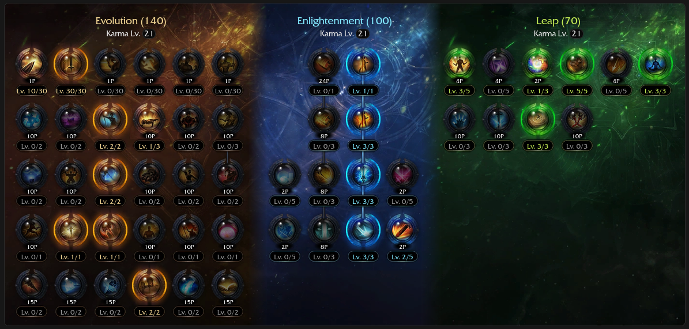

# Standard 🌱

<div class="build-card-row" markdown>
<div class="build-card" data-updated="2026-08-09" markdown>

<div class="build-stats">
<div class="stat"><span class="stat-label">Difficulty</span><span class="stat-value">7 / 10</span><div class="stat-bar-track"><div class="stat-bar-fill" style="width: 70%"></div></div></div>
<div class="stat"><span class="stat-label">Trixion DPS</span><span class="stat-value">Not measured</span></div>
<div class="stat"><span class="stat-label">Playstyle</span><span class="stat-value">AFK Simulator</span></div>
</div>

**Best For:**{: .best-for } Brand-new Remaining Energy players with no Ark Grid yet.

**Tradeoff:**{: .tradeoff } Legacy build with some downtime and little to no recovery.

- Last bastion of the classic Remaining Energy gameplay, now powercrept.
- Counter is used in rotation often, you must hold it when necessary.
- Simple to learn and execute, with better mobility than modern builds.

</div>
<!-- Build profile pentagon. Order: Difficulty, DPS, Mobility, Recovery, Speed (0-10).
     - DPS 8.5 follows the strict -0.5-per-rank pattern below 333 Ceiling
       (9), consistent with the rest of the RE family.
     - Mobility 5 is standard across all RE builds.
     - Recovery/Speed are this build's own read - edit freely. -->
<div class="pentagon-badge" data-build="standard" data-family="re" markdown>
<div class="pentagon-badge-title">Build Profile</div>
<div class="pentagon-svg-mount"></div>
<div class="pentagon-badge-extra" markdown>
[KR Video Guide](https://www.youtube.com/watch?v=pZDYek5l1og&t=467s){ .video-chip } [Video Gameplay](https://www.youtube.com/watch?v=xmxCjwImyrg){ .video-chip }
</div>
</div>
</div>

!!! info ""
    Since this is a beginner legacy build, this guide strays slightly from the norm to offer a smoother experience without deep min-maxing. For instance, you won't need mana food or stimulants to enjoy the gameplay.

## Skill Codes

!!! danger "Before importing"
    Make sure you've read [Essentials](essentials.md), then apply both "Ark Passive" and "Skill" to be safe. For [Gems](#gems), follow the guide.

=== "Standard"

    ```
    5F7D5490D9E2C0E26CF09BBA7300EE3738585110117637ED10C8C1ED04B5AF1E35B6428D7172B4FB399678D0F83CE64D3232A844396609F8F5466877D357B98D
    ```

## Ark Setup



<div class="setup-panel" data-accent="pink" markdown>

<div class="setup-notes" markdown>

<details class="setup-note" data-kind="tip" open markdown>
<summary><span class="setup-note-tag">Tip</span> Ark Grid<span class="setup-note-arrow"></span></summary>

- Standard is playable without Ark Grid by design, but you can use the 111 core setup if you already have it.
    - Save your Ark Grid cores for when you're ready to transition to a modern Deathblade build.

</details>

<details class="setup-note" data-kind="note" open markdown>
<summary><span class="setup-note-tag">Note</span> Adjustments<span class="setup-note-arrow"></span></summary>

- Use the [Ark Passive Calculator](../resources.md#ark-passive-calculator) to optimize Evolution nodes if needed.

</details>

</div>

</div>

## Skill Setup

<div class="setup-panel" data-accent="lavender" markdown>

<div class="skill-setup" data-family="re" markdown>
<script type="application/json">
[
  {"id": "spincutter", "name": "Spincutter", "level": 4, "tripods": [3], "rune": {"tier": "legendary", "name": "Galewind"}},
  {"id": "soulabsorber", "name": "Soul Absorber", "level": 14, "tripods": [3, 1, 2], "rune": {"tier": "legendary", "name": "Galewind"}},
  {"id": "deathsentence", "name": "Death Sentence", "level": 14, "tripods": [2, 2, 1], "rune": {"tier": "legendary", "name": "Focus"}},
  {"id": "twinshadows", "name": "Twin Shadows", "level": 14, "tripods": [2, 1, 2], "rune": {"tier": "epic", "name": "Wealth"}},
  {"id": "earthcleaver", "name": "Earth Cleaver", "level": 14, "tripods": [3, 3, 1], "rune": {"tier": "legendary", "name": "Vision"}},
  {"id": "turningslash", "name": "Turning Slash", "level": 13, "tripods": [1, 3, 1], "rune": {"tier": "epic", "name": "Focus"}},
  {"id": "maelstrom", "name": "Maelstrom", "level": 10, "tripods": [2, 1, 2], "rune": {"tier": "legendary", "name": "Focus"}},
  {"id": "voidstrike", "name": "Void Strike", "level": 14, "tripods": [3, 1, 2], "rune": {"tier": "legendary", "name": "Wealth"}},
  {"id": "surge", "name": "Deathblade Surge", "subtitle": "Identity"},
  {"id": "deathlyslash", "name": "Deathly Slash", "subtitle": "Technique"},
  {"id": "bladeassault", "name": "Blade Assault", "subtitle": "Awakening"}
]
</script>
</div>

<div class="setup-notes" markdown>

<details class="setup-note" data-kind="tip" open markdown>
<summary><span class="setup-note-tag">Tip</span> Rune Adjustments<span class="setup-note-arrow"></span></summary>

- Use Epic Wealth on Soul Absorber for extra orb generation until you're more familiar with the class.

</details>

</div>

</div>

## Gems

<div class="gem-priority" markdown>

<div class="gem-col gem-col-dmg" markdown>
**Damage** — *Surge is most important.*

<div class="gem-row" markdown>
<span class="gem-chip"><span class="gem-num">1</span>  Surge</span>
<span class="gem-chip"><span class="gem-num">2</span>  Soul Absorber</span>
<span class="gem-chip"><span class="gem-num">3</span>  Death Sentence</span>
<span class="gem-chip"><span class="gem-num">4</span>  Void Strike</span>
<span class="gem-chip"><span class="gem-num">5</span>  Earth Cleaver</span>
<span class="gem-chip"><span class="gem-num">6</span>  Twin Shadows</span>
<span class="gem-chip"><span class="gem-num">7</span>  Turning Slash</span>
</div>
</div>

<div class="gem-col gem-col-cd" markdown>
**Cooldown** — *Playable with Lv 7s, ideally Lv 8s or higher.*

<div class="gem-row" markdown>
<span class="gem-chip"><span class="gem-num">1</span>  Soul Absorber</span>
<span class="gem-chip"><span class="gem-num">2</span>  Death Sentence</span>
<span class="gem-chip"><span class="gem-num">3</span>  Maelstrom</span>
<span class="gem-chip"><span class="gem-num">4</span>  Void Strike</span>
</div>
</div>

</div>

## Rotation

Use Spincutter to approach the boss, use an opener and then repeat the main cycle.

Openers stack Adrenaline and apply synergies efficiently at the start of an encounter.

*Opener from zero orbs:*
{ .lead }

<div class="rotation-line" markdown>
<span class="skill">Maelstrom</span><span class="arrow"> → </span><span class="skill">Twin Shadows</span><span class="arrow"> → </span><span class="skill">Turning Slash</span><span class="arrow"> → </span><span class="skill">Soul Absorber</span><span class="arrow"> → </span><span class="skill">Void Strike</span><span class="arrow"> → </span><span class="skill">Deathly Slash</span><span class="arrow"> → </span><span class="skill">Surge</span>
</div>

??? note "*Opener from 3 orbs with {: .skill-icon } Stimulant (optional):*"
    <div class="rotation-line" markdown>
    <span class="skill">Twin Shadows</span><span class="arrow"> → </span><span class="skill">Death Sentence</span><span class="arrow"> → </span><span class="skill">Maelstrom</span><span class="arrow"> → </span><span class="skill">Turning Slash</span><span class="arrow"> → </span><span class="skill">Deathly Slash</span><span class="arrow"> → </span><span class="skill">Surge</span><span class="arrow"> → </span><span class="skill">Soul Absorber</span><span class="arrow"> → </span><span class="skill">Void Strike</span><span class="arrow"> → </span><span class="skill">Twin Shadows</span><span class="arrow"> → </span><span class="skill">Death Sentence</span><span class="arrow"> → </span><span class="skill">Surge</span>
    </div>

*Main repeating cycle:*
{ .lead }

<div class="rotation-line" markdown>
<span class="skill">Twin Shadows</span><span class="arrow"> → </span><span class="skill">Death Sentence</span><span class="arrow"> → </span><span class="skill">Maelstrom</span><span class="arrow"> → </span><span class="skill skill-situational">Deathly Slash<span class="skill-situational-tag">**every other rotation**</span></span><span class="skill">Turning Slash</span><span class="arrow"> → </span><span class="skill">Earth Cleaver</span><span class="arrow"> → </span><span class="skill">Soul Absorber</span><span class="arrow"> → </span><span class="skill">Void Strike</span><span class="arrow"> → </span><span class="skill">Surge</span>
</div>

- <span class="skill-chip">Deathly Slash</span> is only available every other rotation, just keep going if it's on cooldown.
- Use <span class="skill-chip">Spincutter</span>  during downtime to reposition, or hold it to dodge upcoming attacks.
- Use <span class="skill-chip">Blade Assault</span> for damage, or hold it for Hyper Awakening or a clutch recovery.
- The rotation is bottle-necked by Soul Absorber's cooldown. Skip Earth Cleaver if it's up.

*Recovery:*
{ .lead }

- Use spare Twin Shadows or Maelstrom stacks to recover if it'll help you reach 3 orbs.
    - If not, just AFK or Surge with 2 orbs and AFK. Welcome to Standard Remaining Energy.

## DPS Spread

<p class="dps-showcase-caption">Full Lv 10 gems</p>

<div class="dps-showcase" markdown>
<div class="dps-showcase-frame" markdown>
<div class="dps-chart" data-icon-base="re" data-labels="Deathly Slash,Surge,Soul Absorber,Death Sentence,Void Strike,Earth Cleaver,Twin Shadows,Turning Slash,Bleed,Maelstrom" data-values="19.1,18.1,14.3,11.1,11.1,10,8.1,6.5,0.8,0.5"></div>
</div>
</div>