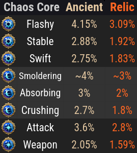
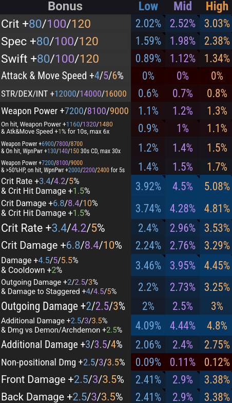

# Additional Resources


## Bonus Skill Codes

=== "Paradise"

    === "Early Levels"

        ```
        6DA43AC633E2CEC99E42A67CC7C650EF321176822375B4CE0FFFFD98E40F5C56F2FBEE9A1A60DBB0DE1D6F4FA2F83C63D4350F09E0A43F4536D632FEFD5E1B05
        ```

    === "Late Levels"

        ```
        BFE03CBB4F77DF0F01E5140695FA2010C9B1D47B03BBE27D7855E04EE259B1CA012D2AFD8D558CB98EE607B5D6FDB071244ABF56DDE760D513AC66FC26C6FBC8
        ```

=== "Chaos Dungeon"

    ```
    5BC069F349F703CA2B9B9B732BB3629E493826BE8BEA2FF11FF1575D1258D07FAA57A9FADBF188946EF1E2DB1CD6779759FF6F7EA4138A86EB19F6505242CC98
    ```

=== "111 (Void Skip)"

    *Alternative to Standard RE — KR guide available in Useful Links below.*

    ```
    FB388C4F19F70DE5311D21E59D93BE5D1B9935691AB3B6F2457D466875600C7A581AE3DFA172017D17440BEC09FB7A05BEE420C68F6788139A428497A91B802E
    ```

## Ark Passive Calculator

*Finds the optimal Evolution nodes for your deathblade and team setup. See spreadsheet [1](https://docs.google.com/spreadsheets/d/1RKpzg6sPNe7fuPDudJHAs0qbFukOwSyhMynDOijfoKY/edit?usp=sharing) or [2](https://docs.google.com/spreadsheets/d/1_0J7liyM_yw16pyn6TKlF1YGaIt5n_A9hSoLnT3yTUc/edit?usp=sharing) for verification.*

<div class="ap-calc">

<div class="ap-calc-layout">

<!-- Fixed Gear: filled out once to match your character, organized by
     which final stat each field feeds - not by which item slot it's on,
     since a ring's Crit Rate roll and its Crit Dmg roll matter for
     completely different totals and were previously scattered across
     unrelated groups (Rings/Bracelet/Ark Grid/Engravings). -->
<div class="ap-calc-gear">

  <!-- Crit Rate -->
  <div class="ap-calc-group ap-calc-group--crit-rate">
    <div class="ap-calc-group-title">Crit Rate</div>
    <div class="ap-calc-field-row">
      <label class="ap-calc-field-label" for="ap-crit-stat">Crit Stat</label>
      <span class="ap-value-display" data-for="ap-crit-stat"></span>
      <input type="number" id="ap-crit-stat" class="ap-crit-stat" min="0" max="750" step="1" value="658">
    </div>
    <div class="ap-calc-field-row ap-calc-field-row-pair">
      <label class="ap-calc-field-label">Rings</label>
      <div class="ap-calc-pair">
        <select id="ap-ring1-rate" class="ap-ring1-rate">
          <option value="None">None</option>
          <option value="Low">0.40%</option>
          <option value="Mid" selected>0.95%</option>
          <option value="High">1.55%</option>
        </select>
        <select id="ap-ring2-rate" class="ap-ring2-rate">
          <option value="None">None</option>
          <option value="Low">0.40%</option>
          <option value="Mid" selected>0.95%</option>
          <option value="High">1.55%</option>
        </select>
      </div>
    </div>
    <div class="ap-calc-field-row ap-calc-field-row-pair">
      <label class="ap-calc-field-label">Bracelet</label>
      <div class="ap-calc-pair">
        <select id="ap-bracelet-rate" class="ap-bracelet-rate">
          <option value="None">None</option>
          <option value="Low">3.40%</option>
          <option value="Mid" selected>4.20%</option>
          <option value="High">5.00%</option>
        </select>
        <select id="ap-bracelet-rate-2" class="ap-bracelet-rate-2">
          <option value="None" selected>None</option>
          <option value="Low">3.40%</option>
          <option value="Mid">4.20%</option>
          <option value="High">5.00%</option>
        </select>
      </div>
    </div>
    <div class="ap-calc-field-row">
      <label class="ap-calc-field-label" for="ap-adrenaline">Adrenaline</label>
      <span class="ap-value-display" data-for="ap-adrenaline"></span>
      <select id="ap-adrenaline" class="ap-adrenaline">
        <option value="Not Used">Not Used</option>
        <option value="0 Nodes">0 Nodes</option>
        <option value="1 Nodes">1 Nodes</option>
        <option value="2 Nodes">2 Nodes</option>
        <option value="3 Nodes">3 Nodes</option>
        <option value="4 Nodes" selected>4 Nodes</option>
      </select>
    </div>
    <div class="ap-calc-field-row ap-calc-field-row-range ap-calc-field-row-range--inline">
      <label class="ap-calc-field-label" for="ap-adrenaline-uptime">Adrenaline Uptime</label>
      <div class="ap-calc-range-line">
        <input type="range" id="ap-adrenaline-uptime" class="ap-adrenaline-uptime" min="0" max="100" step="1" value="100">
        <span class="ap-calc-range-value">100%</span>
      </div>
    </div>
  </div>

  <!-- Crit Damage -->
  <div class="ap-calc-group ap-calc-group--crit-dmg">
    <div class="ap-calc-group-title">Crit Damage</div>
    <div class="ap-calc-field-row ap-calc-field-row-pair">
      <label class="ap-calc-field-label">Rings</label>
      <div class="ap-calc-pair">
        <select id="ap-ring1-dmg" class="ap-ring1-dmg">
          <option value="None">None</option>
          <option value="Low">1.20%</option>
          <option value="Mid">2.40%</option>
          <option value="High" selected>4.00%</option>
        </select>
        <select id="ap-ring2-dmg" class="ap-ring2-dmg">
          <option value="None">None</option>
          <option value="Low">1.20%</option>
          <option value="Mid">2.40%</option>
          <option value="High" selected>4.00%</option>
        </select>
      </div>
    </div>
    <div class="ap-calc-field-row ap-calc-field-row-pair">
      <label class="ap-calc-field-label">Bracelet</label>
      <div class="ap-calc-pair">
        <select id="ap-bracelet-dmg" class="ap-bracelet-dmg">
          <option value="None">None</option>
          <option value="Low" selected>6.80%</option>
          <option value="Mid">8.40%</option>
          <option value="High">10.00%</option>
        </select>
        <select id="ap-bracelet-dmg-2" class="ap-bracelet-dmg-2">
          <option value="None" selected>None</option>
          <option value="Low">6.80%</option>
          <option value="Mid">8.40%</option>
          <option value="High">10.00%</option>
        </select>
      </div>
    </div>
    <div class="ap-calc-field-row">
      <label class="ap-calc-field-label" for="ap-kbw">Keen Blunt Weapon</label>
      <span class="ap-value-display" data-for="ap-kbw"></span>
      <select id="ap-kbw" class="ap-kbw">
        <option value="Not Used">Not Used</option>
        <option value="0 Nodes">0 Nodes</option>
        <option value="1 Nodes">1 Nodes</option>
        <option value="2 Nodes">2 Nodes</option>
        <option value="3 Nodes">3 Nodes</option>
        <option value="4 Nodes" selected>4 Nodes</option>
      </select>
    </div>
    <div class="ap-calc-field-row">
      <label class="ap-calc-field-label" for="ap-kbw-stone">Ability Stone: Keen Blunt Weapon</label>
      <span class="ap-value-display" data-for="ap-kbw-stone"></span>
      <select id="ap-kbw-stone" class="ap-kbw-stone">
        <option value="0 Lv." selected>Lv. 0</option>
        <option value="1 Lv.">Lv. 1</option>
        <option value="2 Lv.">Lv. 2</option>
        <option value="3 Lv.">Lv. 3</option>
        <option value="4 Lv.">Lv. 4</option>
      </select>
    </div>
  </div>

  <!-- Crit Hit Damage -->
  <div class="ap-calc-group ap-calc-group--oncrit-dmg">
    <div class="ap-calc-group-title">Crit Hit Damage</div>
    <div class="ap-calc-field-row ap-calc-field-row-pair">
      <label class="ap-calc-field-label">Bracelet</label>
      <div class="ap-calc-pair ap-calc-pair-checks">
        <label class="ap-calc-pair-check">
          <input type="checkbox" id="ap-crit-rate-dual" class="ap-crit-rate-dual" checked>
          <span class="ap-calc-pair-check-label">1</span>
          <span class="ap-value-display">(1.50%)</span>
        </label>
        <label class="ap-calc-pair-check">
          <input type="checkbox" id="ap-crit-dmg-dual" class="ap-crit-dmg-dual" checked>
          <span class="ap-calc-pair-check-label">2</span>
          <span class="ap-value-display">(1.50%)</span>
        </label>
      </div>
    </div>
    <div class="ap-calc-field-row">
      <label class="ap-calc-field-label" for="ap-flashy-atk">Chaos Core: Flashy Attack</label>
      <span class="ap-value-display" data-for="ap-flashy-atk"></span>
      <select id="ap-flashy-atk" class="ap-flashy-atk">
        <option value="None">None</option>
        <option value="Epic-Leg 10P">Epic-Leg 10P</option>
        <option value="Relic 17P">Relic 17P</option>
        <option value="Ancient 17P" selected>Ancient 17P</option>
      </select>
    </div>
  </div>

  <!-- Additional Damage -->
  <div class="ap-calc-group ap-calc-group--add-dmg">
    <div class="ap-calc-group-title">Additional Damage</div>
    <div class="ap-calc-field-row">
      <label class="ap-calc-field-label" for="ap-weapon-quality">Weapon Quality</label>
      <span class="ap-value-display" data-for="ap-weapon-quality"></span>
      <input type="number" id="ap-weapon-quality" class="ap-weapon-quality" min="0" max="100" step="1" value="100">
    </div>
    <div class="ap-calc-field-row">
      <label class="ap-calc-field-label" for="ap-necklace">Necklace</label>
      <span class="ap-value-display" data-for="ap-necklace"></span>
      <select id="ap-necklace" class="ap-necklace">
        <option value="None">None</option>
        <option value="Low">Low</option>
        <option value="Mid" selected>Mid</option>
        <option value="High">High</option>
      </select>
    </div>
    <div class="ap-calc-field-row ap-calc-field-row-pair">
      <label class="ap-calc-field-label">Bracelet</label>
      <div class="ap-calc-pair">
        <select id="ap-bracelet-addA" class="ap-bracelet-addA">
          <option value="None" selected>None</option>
          <option value="Low">3.00%</option>
          <option value="Mid">3.50%</option>
          <option value="High">4.00%</option>
        </select>
        <select id="ap-bracelet-addB" class="ap-bracelet-addB" title="vs Demons">
          <option value="None" selected>None</option>
          <option value="Low">2.50%</option>
          <option value="Mid">3.00%</option>
          <option value="High">3.50%</option>
        </select>
      </div>
    </div>
    <div class="ap-calc-field-row">
      <label class="ap-calc-field-label" for="ap-astrogem-lv">Astrogem Level</label>
      <span class="ap-value-display" data-for="ap-astrogem-lv"></span>
      <input type="number" id="ap-astrogem-lv" class="ap-astrogem-lv" min="0" max="100" step="1" value="56">
    </div>
    <div class="ap-calc-field-row">
      <label class="ap-calc-field-label" for="ap-sh-pet">Stronghold Pet</label>
      <span class="ap-value-display" data-for="ap-sh-pet"></span>
      <select id="ap-sh-pet" class="ap-sh-pet">
        <option value="None">None</option>
        <option value="Low">Rare</option>
        <option value="Mid">Epic</option>
        <option value="High" selected>Legendary</option>
      </select>
    </div>
    <div class="ap-calc-field-row">
      <label class="ap-calc-field-label" for="ap-stable-atk">Chaos Core: Stable Attack</label>
      <span class="ap-value-display" data-for="ap-stable-atk"></span>
      <select id="ap-stable-atk" class="ap-stable-atk">
        <option value="None|0P" selected>None</option>
        <option value="Legend|14P">Legend 14P</option>
        <option value="Relic|14P">Relic 14P</option>
        <option value="Relic|17P">Relic 17P</option>
        <option value="Relic|18P">Relic 18P</option>
        <option value="Relic|19P">Relic 19P</option>
        <option value="Relic|20P">Relic 20P</option>
        <option value="Ancient|14P">Ancient 14P</option>
        <option value="Ancient|17P">Ancient 17P</option>
        <option value="Ancient|18P">Ancient 18P</option>
        <option value="Ancient|19P">Ancient 19P</option>
        <option value="Ancient|20P">Ancient 20P</option>
      </select>
    </div>
  </div>

    <!-- Leap Rank is the only field feeding Evolution Damage directly (Yearning,
       the other Evo Dmg source, lives in Party & Positioning instead) - a full
       bordered group for one dropdown was mostly empty box, so it's a slim
       tagged strip spanning the gear column instead of its own card. -->
  <div class="ap-calc-mini-field ap-calc-mini-field--evo-dmg">
    <span class="ap-calc-mini-field-tag">Evo Dmg</span>
    <label class="ap-calc-field-label" for="ap-evo-karma">Karmic Leap Rank</label>
    <span class="ap-value-display" data-for="ap-evo-karma"></span>
    <select id="ap-evo-karma" class="ap-evo-karma">
      <option value="1">1</option>
      <option value="2">2</option>
      <option value="3">3</option>
      <option value="4">4</option>
      <option value="5">5</option>
      <option value="6" selected>6</option>
    </select>
  </div>

</div> <!-- end ap-calc-gear -->

<!-- Live: the stuff you actually re-toggle per pull/party, plus the result
     grid and verification numbers it feeds - kept together so nothing you
     change often is more than a glance away from its effect. -->
<div class="ap-calc-live">

  <div class="ap-calc-party-card">
    <div class="ap-calc-group-title">Party &amp; Positioning</div>
    <div class="ap-calc-field-row">
      <label class="ap-calc-field-label" for="ap-crit-syn1">Crit Rate Synergy 1</label>
      <span class="ap-value-display" data-for="ap-crit-syn1"></span>
      <input type="checkbox" id="ap-crit-syn1" class="ap-crit-syn1">
    </div>
    <div class="ap-calc-field-row">
      <label class="ap-calc-field-label" for="ap-crit-syn2">Crit Rate Synergy 2</label>
      <span class="ap-value-display" data-for="ap-crit-syn2"></span>
      <input type="checkbox" id="ap-crit-syn2" class="ap-crit-syn2">
    </div>
    <div class="ap-calc-field-row">
      <label class="ap-calc-field-label" for="ap-crit-hit-syn-1">Crit Hit Damage Synergy 1</label>
      <span class="ap-value-display" data-for="ap-crit-hit-syn-1"></span>
      <input type="checkbox" id="ap-crit-hit-syn-1" class="ap-crit-hit-syn-1">
    </div>
    <div class="ap-calc-field-row">
      <label class="ap-calc-field-label" for="ap-crit-hit-syn-2">Crit Hit Damage Synergy 2</label>
      <span class="ap-value-display" data-for="ap-crit-hit-syn-2"></span>
      <input type="checkbox" id="ap-crit-hit-syn-2" class="ap-crit-hit-syn-2">
    </div>
    <div class="ap-calc-field-row">
      <label class="ap-calc-field-label" for="ap-yearning">Support: Passionate Dance (Evo Dmg)</label>
      <span class="ap-value-display" data-for="ap-yearning"></span>
      <input type="checkbox" id="ap-yearning" class="ap-yearning" checked>
    </div>
    <div class="ap-calc-field-row ap-calc-field-row-range ap-calc-field-row-range--inline">
      <label class="ap-calc-field-label" for="ap-back-attack-rate">Back-Attack Rate</label>
      <div class="ap-calc-range-line">
        <input type="range" id="ap-back-attack-rate" class="ap-back-attack-rate" min="0" max="100" step="1" value="90">
        <span class="ap-calc-range-value">90%</span>
      </div>
    </div>
  </div>

  <!-- Top 3 combinations, ranked by % of the best. Replaces the old 3x3
       grid + progress bars: with 9 cells the only things that mattered
       were "what's my best combo" and "what am I giving up if I run
       something else", so a ranked list answers both directly instead of
       asking the reader to scan a matrix for the highlighted cell. -->
  <div class="ap-calc-results">
    <div class="ap-calc-results-title">Top Combinations</div>
    <div class="ap-calc-result-row" data-rank="1">
      <span class="ap-result-rank">1</span>
      <span class="ap-result-combo">—</span>
      <span class="ap-result-delta">—</span>
      <span class="ap-result-pct">—</span>
    </div>
    <div class="ap-calc-result-row" data-rank="2">
      <span class="ap-result-rank">2</span>
      <span class="ap-result-combo">—</span>
      <span class="ap-result-delta">—</span>
      <span class="ap-result-pct">—</span>
    </div>
    <div class="ap-calc-result-row" data-rank="3">
      <span class="ap-result-rank">3</span>
      <span class="ap-result-combo">—</span>
      <span class="ap-result-delta">—</span>
      <span class="ap-result-pct">—</span>
    </div>
  </div>

  <!-- Verification + Result -->
  <div class="ap-calc-summary">
    <div class="ap-calc-stat-cards">

      <div class="ap-stat-card">
        <div class="ap-stat-card-title">Base Setup</div>
        <div class="ap-stat-card-row"><span class="ap-summary-label ap-summary-label--critrate">Crit Rate</span><span class="ap-summary-base-critrate ap-summary-value">—</span></div>
        <div class="ap-stat-card-row"><span class="ap-summary-label ap-summary-label--critdmg">Crit Dmg</span><span class="ap-summary-base-critdmg ap-summary-value">—</span></div>
        <div class="ap-stat-card-row"><span class="ap-summary-label ap-summary-label--oncrit">Crit Hit Dmg</span><span class="ap-summary-base-oncrit ap-summary-value">—</span></div>
        <div class="ap-stat-card-row"><span class="ap-summary-label ap-summary-label--evodmg">Evo Dmg</span><span class="ap-summary-base-evodmg ap-summary-value">—</span></div>
        <div class="ap-stat-card-row"><span class="ap-summary-label ap-summary-label--adddmg">Add Dmg</span><span class="ap-summary-base-adddmg ap-summary-value">—</span></div>
        <div class="ap-stat-card-row ap-stat-card-row--kbw-base ap-stat-card-row--hidden"><span class="ap-summary-label ap-summary-label--critdmg">KBW Dmg</span><span class="ap-summary-base-kbw ap-summary-value">—</span></div>
        <div class="ap-stat-card-row ap-stat-card-row--kbwstone-base ap-stat-card-row--hidden"><span class="ap-summary-label ap-summary-label--critdmg">KBW Stone Dmg</span><span class="ap-summary-base-kbwstone ap-summary-value">—</span></div>
      </div>

      <div class="ap-stat-card ap-stat-card-best">
        <div class="ap-stat-card-title">Best Setup <span class="ap-summary-best-label ap-stat-card-subtitle">—</span></div>
        <div class="ap-stat-card-row"><span class="ap-summary-label ap-summary-label--critrate">Crit Rate</span><span class="ap-summary-best-crit ap-summary-value">—</span></div>
        <div class="ap-stat-card-row"><span class="ap-summary-label ap-summary-label--oncrit">Crit Hit Dmg</span><span class="ap-summary-best-oncrit ap-summary-value">—</span></div>
        <div class="ap-stat-card-row"><span class="ap-summary-label ap-summary-label--evodmg">Evo Dmg</span><span class="ap-summary-best-evodmg ap-summary-value">—</span></div>
        <div class="ap-stat-card-row"><span class="ap-summary-label ap-summary-label--adddmg">Add Dmg</span><span class="ap-summary-best-adddmg ap-summary-value">—</span></div>
        <div class="ap-stat-card-row ap-stat-card-row--kbw-best ap-stat-card-row--hidden"><span class="ap-summary-label ap-summary-label--critdmg">KBW Dmg</span><span class="ap-summary-best-kbw ap-summary-value">—</span></div>
        <div class="ap-stat-card-row ap-stat-card-row--kbwstone-best ap-stat-card-row--hidden"><span class="ap-summary-label ap-summary-label--critdmg">KBW Stone Dmg</span><span class="ap-summary-best-kbwstone ap-summary-value">—</span></div>
      </div>

    </div>
  </div>

  <p class="ap-calc-footnote">Your inputs are saved in this browser so they're still here next visit. <button type="button" class="ap-calc-reset">Reset to defaults</button></p>

</div> <!-- end ap-calc-live -->

</div> <!-- end ap-calc-layout -->

<!-- Bracelet Line Comparison: a different question than the grid above -
     "of the bracelet lines I have data for, which is worth the most DPS"
     rather than "what's my best Ark Passive setup". Values are computed
     against your Best Setup above with your currently-selected bracelet
     lines zeroed out first, so each % is that line's value on its own -
     see the JS comment above computeBraceletComparison() for the full
     methodology and the deliberate simplifications (Damage+CD is the
     sheet's own averaged flat+CDR estimate for its reference build,
     Stagger/Back-Attack DPS-share are fixed assumptions, Front Dmg/
     Non-positional Dmg are left out entirely). Deliberately full-width and
     OUTSIDE .ap-calc-live (which is position: sticky) - a stacked list of
     11 lines in that narrow sticky column was expanding a fixed-height
     column that's supposed to stay glance-able while you scroll the gear
     list; living here as a plain, non-sticky, full-width table gives it
     room to breathe horizontally instead of pushing that column's height
     around. -->
<details class="ap-brace-compare">
  <summary>Bracelet Line Comparison</summary>
  <div class="ap-brace-compare-body">
    <p class="ap-brace-compare-intro">Candidate bracelet lines, valued as if each were the only line on your bracelet, against your Best Setup above.</p>
    <div class="ap-brace-compare-inputs">
      <div class="ap-calc-field-row">
        <label class="ap-calc-field-label" for="ap-brace-demon-dmg">Demon Dmg %</label>
        <input type="number" id="ap-brace-demon-dmg" class="ap-brace-demon-dmg" min="0" max="15" step="0.1" value="7">
      </div>
      <div class="ap-calc-field-row">
        <label class="ap-calc-field-label" for="ap-brace-crit-stat-equipped">Crit Stat from Current Bracelet</label>
        <input type="number" id="ap-brace-crit-stat-equipped" class="ap-brace-crit-stat-equipped" min="60" max="120" step="1" value="82">
      </div>
      <div class="ap-brace-spec-toggle">
        <span class="ap-calc-field-label">Spec Scaling</span>
        <label class="ap-brace-radio-label">
          <input type="radio" name="ap-brace-deathblade-spec" id="ap-brace-spec-re" class="ap-brace-spec-re" checked>
          RE
        </label>
        <label class="ap-brace-radio-label">
          <input type="radio" name="ap-brace-deathblade-spec" id="ap-brace-spec-surge" class="ap-brace-spec-surge">
          Surge
        </label>
      </div>
    </div>
    <table class="ap-brace-compare-table">
      <thead>
        <tr>
          <th class="ap-brace-th-label">Line</th>
          <th class="ap-brace-th-low">Low</th>
          <th class="ap-brace-th-mid">Mid</th>
          <th class="ap-brace-th-high">High</th>
        </tr>
      </thead>
      <tbody class="ap-brace-compare-rows"></tbody>
    </table>
    <p class="ap-brace-compare-flip-note">&dagger; Equipping this line's Mid tier may change which split/keystone combo is your actual best - worth a re-check.</p>
    <p class="ap-brace-compare-footer-note">High item levels and support buffs cause flat bonuses (WP/Dex) to scale poorly, adding at best 2% and 1% respectively.</p>
  </div>
</details>

</div> <!-- end ap-calc -->

## CPM Calculator

<p class="page-banner page-banner-warning">Not applicable to NA servers yet</p>

*Compares Trixion damage to raid damage. Watch [this](https://www.youtube.com/watch?v=dlUS8vUaNLA) to learn about Trixion multipliers.*

*Enter your Raid CPM and back-attack rate to compare builds. Highest Final Multiplier wins.*

<div class="cpm-calc">

<div class="cpm-calc-row" data-build="333-re">
<div class="cpm-calc-row-header">
<span class="cpm-calc-row-title">333 (Ceiling)</span>
<span class="cpm-calc-row-meta">Trixion CPM 15.122 — Remaining Energy</span>
</div>
<div class="cpm-calc-inputs">
<label class="cpm-calc-field">
<span class="cpm-calc-field-label">Raid CPM</span>
<input type="number" class="cpm-calc-raidcpm" step="0.01" min="0" placeholder="e.g. 9.5">
</label>
<label class="cpm-calc-field">
<span class="cpm-calc-field-label">Back-Attack %</span>
<input type="number" class="cpm-calc-ba-input" step="0.01" min="0" max="100" placeholder="e.g. 75">
</label>
<div class="cpm-calc-toggle">
<label><input type="radio" name="cpm-calc-ba-mode-333-re" value="rate" checked> Rate</label>
<label><input type="radio" name="cpm-calc-ba-mode-333-re" value="ratio"> Ratio</label>
</div>
<label class="cpm-calc-field cpm-calc-field-muted">
<span class="cpm-calc-field-label">Base Multiplier</span>
<input type="number" class="cpm-calc-basemult-input" step="0.01" min="0">
</label>
</div>
<div class="cpm-calc-output">
<div class="cpm-calc-output-item">
<span class="cpm-calc-output-label">Adjusted Multiplier</span>
<span class="cpm-calc-adj-value">—</span>
</div>
<div class="cpm-calc-output-item">
<span class="cpm-calc-output-label">Final Multiplier</span>
<span class="cpm-calc-result-value">—</span>
</div>
</div>
<div class="stat-bar-track stat-bar-track-teal">
<div class="stat-bar-fill stat-bar-fill-teal cpm-calc-bar-fill" style="width: 0%"></div>
</div>
</div>

<div class="cpm-calc-row" data-build="111-surge">
<div class="cpm-calc-row-header">
<span class="cpm-calc-row-title">111 (Classic)</span>
<span class="cpm-calc-row-meta">Trixion CPM 10.952 — Surge</span>
</div>
<div class="cpm-calc-inputs">
<label class="cpm-calc-field">
<span class="cpm-calc-field-label">Raid CPM</span>
<input type="number" class="cpm-calc-raidcpm" step="0.01" min="0" placeholder="e.g. 6.5">
</label>
<label class="cpm-calc-field">
<span class="cpm-calc-field-label">Back-Attack %</span>
<input type="number" class="cpm-calc-ba-input" step="0.01" min="0" max="100" placeholder="e.g. 90">
</label>
<div class="cpm-calc-toggle">
<label><input type="radio" name="cpm-calc-ba-mode-111-surge" value="rate" checked> Rate</label>
<label><input type="radio" name="cpm-calc-ba-mode-111-surge" value="ratio"> Ratio</label>
</div>
<label class="cpm-calc-field cpm-calc-field-muted">
<span class="cpm-calc-field-label">Base Multiplier</span>
<input type="number" class="cpm-calc-basemult-input" step="0.01" min="0">
</label>
</div>
<div class="cpm-calc-output">
<div class="cpm-calc-output-item">
<span class="cpm-calc-output-label">Adjusted Multiplier</span>
<span class="cpm-calc-adj-value">—</span>
</div>
<div class="cpm-calc-output-item">
<span class="cpm-calc-output-label">Final Multiplier</span>
<span class="cpm-calc-result-value">—</span>
</div>
</div>
<div class="stat-bar-track stat-bar-track-teal">
<div class="stat-bar-fill stat-bar-fill-teal cpm-calc-bar-fill" style="width: 0%"></div>
</div>
</div>

<div class="cpm-calc-row" data-build="222-surge">
<div class="cpm-calc-row-header">
<span class="cpm-calc-row-title">222 (Speedy)</span>
<span class="cpm-calc-row-meta">Trixion CPM 9.756 — Surge</span>
</div>
<div class="cpm-calc-inputs">
<label class="cpm-calc-field">
<span class="cpm-calc-field-label">Raid CPM</span>
<input type="number" class="cpm-calc-raidcpm" step="0.01" min="0" placeholder="e.g. 6">
</label>
<label class="cpm-calc-field">
<span class="cpm-calc-field-label">Back-Attack %</span>
<input type="number" class="cpm-calc-ba-input" step="0.01" min="0" max="100" placeholder="e.g. 80">
</label>
<div class="cpm-calc-toggle">
<label><input type="radio" name="cpm-calc-ba-mode-222-surge" value="rate" checked> Rate</label>
<label><input type="radio" name="cpm-calc-ba-mode-222-surge" value="ratio"> Ratio</label>
</div>
<label class="cpm-calc-field cpm-calc-field-muted">
<span class="cpm-calc-field-label">Base Multiplier</span>
<input type="number" class="cpm-calc-basemult-input" step="0.01" min="0">
</label>
</div>
<div class="cpm-calc-output">
<div class="cpm-calc-output-item">
<span class="cpm-calc-output-label">Adjusted Multiplier</span>
<span class="cpm-calc-adj-value">—</span>
</div>
<div class="cpm-calc-output-item">
<span class="cpm-calc-output-label">Final Multiplier</span>
<span class="cpm-calc-result-value">—</span>
</div>
</div>
<div class="stat-bar-track stat-bar-track-teal">
<div class="stat-bar-fill stat-bar-fill-teal cpm-calc-bar-fill" style="width: 0%"></div>
</div>
</div>

</div>

## Gearing Values

*Late game examples including support buffs. Fill [Arsonistic's calculator](https://docs.google.com/spreadsheets/d/1_0J7liyM_yw16pyn6TKlF1YGaIt5n_A9hSoLnT3yTUc/edit?usp=sharing) with your own stats for accuracy.*

<div class="grid cards" style="grid-template-columns: 1fr 3fr;" markdown>

- 
- 

</div>

## Useful Links

| Link | What it's for |
|---|---|
| [Arsonistic's Calculator](https://docs.google.com/spreadsheets/d/1_0J7liyM_yw16pyn6TKlF1YGaIt5n_A9hSoLnT3yTUc/edit?usp=sharing) | *Tune KS/LB, bracelet, answers ALL gearing questions* |
| [KR Calculator (Translated)](https://docs.google.com/spreadsheets/d/1RKpzg6sPNe7fuPDudJHAs0qbFukOwSyhMynDOijfoKY/edit?usp=sharing) | *Simpler, only for Ark Passive settings* |
| [Astrogem Optimizer](https://airplaner.github.io/lostark-arkgrid-gem-locator-v2/) | *Screencapture auto-minmax for Ark Grid* |
| [Lost Ark Bible](https://lostark.bible/) | *Logs and raid statistics* |
| [LOA Logs](https://github.com/snoww/loa-logs) | *DPS meter download* |
| [Lost Ark Nexus](https://lostark-nexus-archive.pages.dev/guides/deathblade/) | *For pre-Ark Grid Standard RE build* |
| [Fatal Wave Dump](https://docs.google.com/document/d/1vs1YC_7adaYwtfN9cHO3x2KuMPq6GcKRlGo5vnsN4Lk/edit) | *For 333 Standard (spincutter) NA build* |
| [Maxroll](https://maxroll.gg/lost-ark) | *Resources for beginners* |
| [Inven RE Guide](https://www.inven.co.kr/board/lostark/5497/140080) | *Korean guide for 333, 111 HH and Void Skip* |
| [Inven 313 Guide](https://www.inven.co.kr/board/lostark/5497/171285) | *Korean guide for 313* |