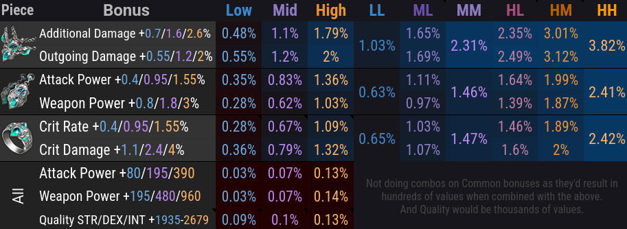

# Additional Resources


## Bonus Skill Codes

=== "Paradise"

    === "Early Levels"

        ```
        6DA43AC633E2CEC99E42A67CC7C650EF321176822375B4CE0FFFFD98E40F5C56F2FBEE9A1A60DBB0DE1D6F4FA2F83C63D4350F09E0A43F4536D632FEFD5E1B05
        ```

    === "Late Levels"

        ```
        BFE03CBB4F77DF0F01E5140695FA2010C9B1D47B03BBE27D7855E04EE259B1CA012D2AFD8D558CB98EE607B5D6FDB071244ABF56DDE760D513AC66FC26C6FBC8
        ```

=== "Chaos Dungeon"

    ```
    5BC069F349F703CA2B9B9B732BB3629E493826BE8BEA2FF11FF1575D1258D07FAA57A9FADBF188946EF1E2DB1CD6779759FF6F7EA4138A86EB19F6505242CC98
    ```

=== "111 (Void Skip)"

    *Alternative to Standard RE — KR guide available in Useful Links below.*

    ```
    FB388C4F19F70DE5311D21E59D93BE5D1B9935691AB3B6F2457D466875600C7A581AE3DFA172017D17440BEC09FB7A05BEE420C68F6788139A428497A91B802E
    ```

## CPM Calculator

*Compares Trixion damage to real raid damage across builds. Check the [Spreadsheet](https://docs.google.com/spreadsheets/d/1l5C427BmEY4P6VJDql2aKyFYJSgIGeRBCJF2FXv_9w4/edit?usp=sharing) and watch this [video](https://www.youtube.com/watch?v=dlUS8vUaNLA) for an explanation of Trixion multipliers. The values shown in this site align with the September update.*

**333 (RE)** — Trixion CPM 15.122, ×1.20 multiplier, 75% B.A. → ×1.1206 *(123 sec, 31 surges)*

| Raid CPM | 9 | 9.5 | 10 | 10.5 | 11 | 11.5 | 12 | 12.5 |
|---|---|---|---|---|---|---|---|---|
| Multiplier | 0.667 | 0.704 | 0.741 | 0.778 | 0.815 | 0.852 | 0.889 | 0.926 |

**111 (Surge)** — Trixion CPM 10.952, ×1.23 multiplier, 90% B.A. → ×1.1975 *(126 sec, 23 surges)*

| Raid CPM | 5.5 | 6 | 6.5 | 7 | 7.5 | 8 | 8.5 | 9 |
|---|---|---|---|---|---|---|---|---|
| Multiplier | 0.601 | 0.656 | 0.711 | 0.765 | 0.82 | 0.875 | 0.929 | 0.984 |

**222 (Surge)** — Trixion CPM 9.756, ×1.22 multiplier, 80% B.A. → ×1.1554 *(123 sec, 20 surges)*

| Raid CPM | 6 | 6.2 | 6.5 | 6.8 | 7.1 | 7.4 | 7.7 | 8 |
|---|---|---|---|---|---|---|---|---|
| Multiplier | 0.71 | 0.734 | 0.77 | 0.805 | 0.841 | 0.876 | 0.912 | 0.947 |

## Gearing Values

*Late game examples including support buffs. Fill [Arsonistic's calculator](https://docs.google.com/spreadsheets/d/1_0J7liyM_yw16pyn6TKlF1YGaIt5n_A9hSoLnT3yTUc/edit?usp=sharing) with your own stats for accuracy.*

!!! note ""
    
    
    

## Useful Links

| Link | What it's for |
|---|---|
| [Arsonistic's Calculator](https://docs.google.com/spreadsheets/d/1_0J7liyM_yw16pyn6TKlF1YGaIt5n_A9hSoLnT3yTUc/edit?usp=sharing) | *Tune KS/LB, bracelet, answers ALL gearing questions* |
| [KR's Calculator (Translated)](https://docs.google.com/spreadsheets/d/1_0J7liyM_yw16pyn6TKlF1YGaIt5n_A9hSoLnT3yTUc/edit?usp=sharing) | *Simpler, only for Ark Passive settings* |
| [Astrogem Optimizer](https://airplaner.github.io/lostark-arkgrid-gem-locator-v2/) | *Screencapture auto-minmax for Ark Grid* |
| [Lost Ark Bible](https://lostark.bible/) | *DPS meter, logs, and raid statistics* |
| [Lost Ark Nexus](https://lostark-nexus-archive.pages.dev/guides/deathblade/) | *Better for newbies, standard build + 111 HH guide* |
| [Fatal Wave Dump](https://docs.google.com/document/d/1vs1YC_7adaYwtfN9cHO3x2KuMPq6GcKRlGo5vnsN4Lk/edit) | *333 Standard (spincutter) or 333 (Ceiling) NA builds* |
| [Inven RE Guide](https://www.inven.co.kr/board/lostark/5497/140080) | *Korean guide for RE 333, 111 HH and Void Skip* |
| [Inven 313 Guide](https://www.inven.co.kr/board/lostark/5497/171285) | *Korean guide for RE 313* |