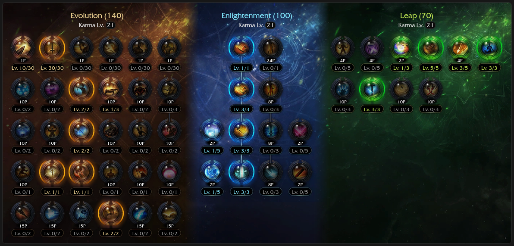
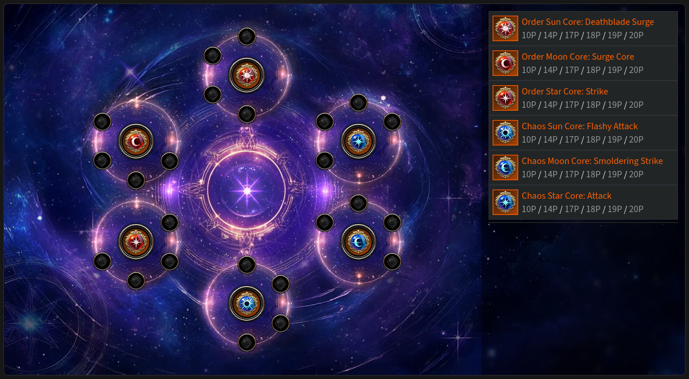
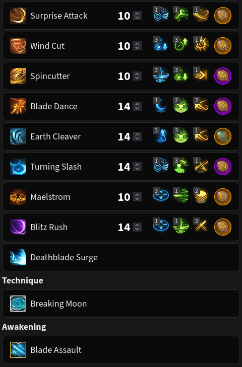
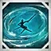
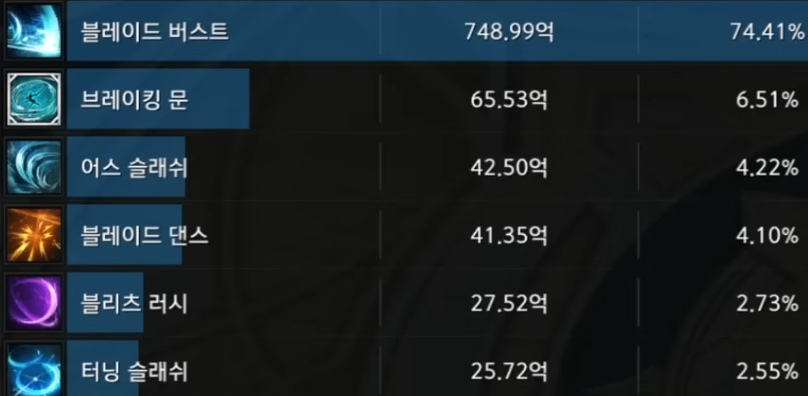

# 111 (Classic) 💥 NOT IN NA SERVERS YET

<div class="build-card" markdown>

<div class="build-stats">
<div class="stat"><span class="stat-label">Difficulty</span><span class="stat-value">7.5 / 10</span></div>
<div class="stat"><span class="stat-label">Trixion DPS</span><span class="stat-value">1.23 Multiplier</span></div>
<div class="stat"><span class="stat-label">Playstyle</span><span class="stat-value">Burst Combo</span></div>
</div>

**Best For:** Players who enjoy building up to one massive, satisfying Surge hit.

**Tradeoff:** All your eggs are in one basket (Surge).

- Satisfying burst windows with the Breaking Moon → Surge combo.
- No need to hold Counter, it charges up to two stacks.
- Very high gem efficiency, Surge is nearly all of your DPS.
- Accessible from zero Ark Grid cores with minor adjustments.
- Must constantly balance Surge back attack rate with Surge CPM.

[KR Video Guide](https://www.youtube.com/watch?v=pzFa5zOuNik){ .video-chip } [KR Video Gameplay](https://www.youtube.com/watch?v=j-2dGp7PGws){ .video-chip }

</div>

## Skill Codes

!!! danger "Before importing"
    Apply both "Ark Passive" and "Skill" to be safe. For [Gems](#gems), follow the guide.

=== "111 Classic ⭐"

    ```
    9AFBA682E2AF248EC0357C6139AB39F73603D1F3583597559FDEB47ED7A071ABD2AE255CB2FF481D09EA6BDF6F653639ADCFB1F1EF01FB11A79379A36DE56B4A
    ```

=== "Pre-Ark Grid"

    *Adds Earth Cleaver CD and uses Blade Dance's Quick Prep tripod to accommodate a lack of Ark Grid.<br>If you're a beginner, swap Raid Captain for Cursed Doll until you're more experienced.*

    ```
    265B124DF8BC69A1937EB6F6DFD9E786F5710527349FFEE44D63AC2FF95F4F719F55127DDD2C326A7B608BEDF91520DB6EB86D2368CD03C3485FD5D50C3250E6
    ```

## Ark Setup




!!! tip ""
    You can level Ark Grid cores to your preference, but keep in mind that 17p Moon grants a second Earth Cleaver stack. This lets you slot a cooldown gem into Blade Dance and unlocks its Weak Point Detection tripod.

!!! note "Adjustments"
    - Use the [DPS Calculator](https://docs.google.com/spreadsheets/d/1_0J7liyM_yw16pyn6TKlF1YGaIt5n_A9hSoLnT3yTUc/copy) to optimize Keen Sense/Limit Break and Master/Critical.
        - Keen Sense 2 + Master is usually best unless you have 2x crit rate synergy or 2x crit rate bracelet.
    - Release Potential 4 / Instant Spell 2 may be needed with +CD bracelet line (needs testing).

## Skill Setup



!!! tip "Rune Adjustments"
    - Use Legendary Purify on Spincutter if needed.
    - Use Legendary Bleed or Poison on Turning Slash if you don't use RC/MI engravings.

??? note "Skill Adjustments"
    - Earth Explosion tripod on Earth Cleaver is up to personal preference.
        - Increased cast speed and extra stack, lowered mobility and damage.
    - Thick Sword Energy tripod increases Wind Cut range but builds less stacks.
    - You can use the Quick Prep tripod on Blade Dance as a safety net.
    - Dark Axel (1-1-2 tripods) can be used instead of Spincutter if you prefer it.

!!! danger "Don't remove synergy from Turning Slash"
    Don't even think about it, the data is not in your favor.

## Gems

<div class="gem-priority" markdown>

<div class="gem-col gem-col-dmg" markdown>
**Damage** — *Prioritize Surge. Surge is everything.*

<div class="gem-row" markdown>
<span class="gem-chip"><span class="gem-num">1</span>  Surge</span>
<span class="gem-chip"><span class="gem-num">2</span>  Earth Cleaver</span>
<span class="gem-chip"><span class="gem-num">3</span>  Blade Dance</span>
<span class="gem-chip"><span class="gem-num">4</span>  Blitz Rush</span>
<span class="gem-chip"><span class="gem-num">5</span>  Turning Slash</span>
</div>
</div>

<div class="gem-col gem-col-cd" markdown>
**Cooldown** — *Playable with Lv 7s, ideally Lv 8s or higher.*

<div class="gem-row" markdown>
<span class="gem-chip"><span class="gem-num">1</span>  Wind Cut</span>
<span class="gem-chip"><span class="gem-num">2</span>  Blitz Rush</span>
<span class="gem-chip"><span class="gem-num">3</span>  Maelstrom</span>
<span class="gem-chip"><span class="gem-num">4</span>  Blade Dance</span>
<span class="gem-chip"><span class="gem-num">5</span>  Turning Slash</span>
<span class="gem-chip"><span class="gem-num">6</span>  Surprise Attack</span>
</div>

Earth Cleaver CD must be used instead of Blade Dance CD pre-Ark Grid. Use Quick Prep tripod on Blade Dance.

</div>

</div>

## Rotation

There's an optimal skill order, but you have flexibility when facing downtime or weaving in mobility skills.

Spincutter is your main mobility skill and backup stack builder. Use it to guarantee a back attack on Surge.

Use the Breaking Moon cycle whenever it's available, then repeat the Main cycle whenever it's not.

*From 3 orbs:*

=== "Opener/Breaking Moon Cycle"

    <div class="rotation-line" markdown>
    <span class="skill">*(  Turning Slash or  Surprise Attack — synergy )*</span><span class="arrow"> → </span><span class="skill">Wind Cut</span><span class="arrow"> → </span><span class="skill">Death Trance</span><span class="arrow"> → </span><span class="skill">Maelstrom</span><span class="arrow"> → </span><span class="skill">Surprise Attack</span><span class="arrow"> → </span><span class="skill">Breaking Moon</span><span class="arrow"> → </span><span class="skill">Surge</span>
    </div>

    - Skip the first action if Adrenaline is stacked and synergy is still applied.
    - If you already have a Maelstrom buff of 3 seconds or more, do not cast it.
    - Breaking Moon grants 60 stacks on hit and empowers your next Surge.

=== "Main Cycle"

    <div class="rotation-line" markdown>
    <span class="skill">Wind Cut</span><span class="arrow"> → </span><span class="skill">Death Trance</span><span class="arrow"> → </span><span class="skill">Maelstrom</span><span class="arrow"> → </span><span class="skill">Surprise Attack</span><span class="arrow"> → </span><span class="skill">Wind Cut</span><span class="arrow"> → </span><span class="skill">Earth Cleaver</span><span class="arrow"> → </span><span class="skill">Turning Slash</span><span class="arrow"> → </span><span class="skill">Blade Dance</span><span class="arrow"> → </span><span class="skill">Blitz Rush</span><span class="arrow"> → </span><span class="skill">*(  Surprise Attack — situational )*</span><span class="arrow"> → </span><span class="skill">Surge</span>
    </div>

    - This is the ideal rotation on a stationary boss.
    - You can skip the final Surprise Attack when you have excess stacks.
    - Use 'Main Cycle (RC+MI)' instead if you wish to try-hard engraving efficiency in a raid scenario. 

=== "Main Cycle (RC+MI)"

    This is an alternate version of the main cycle that optimizes Raid Captain and Mass Increase efficiency.

    <div class="rotation-line" markdown>
    <span class="skill">Maelstrom</span><span class="arrow"> → </span><span class="skill">Wind Cut</span><span class="arrow"> → </span><span class="skill">Death Trance</span><span class="arrow"> → </span><span class="skill">Surprise Attack</span><span class="arrow"> → </span><span class="skill">Wind Cut</span><span class="arrow"> → </span><span class="skill">Earth Cleaver</span><span class="arrow"> → </span><span class="skill">Turning Slash</span><span class="arrow"> → </span><span class="skill">Maelstrom</span><span class="arrow"> → </span><span class="skill">Blade Dance</span><span class="arrow"> → </span><span class="skill">Blitz Rush</span><span class="arrow"> → </span><span class="skill">Surprise Attack</span><span class="arrow"> → </span><span class="skill">Surge</span>
    </div>

    - Needs testing and fact-checking when the update arrives to NA.
    - This cycle aims to cover both Wind Cuts and Surge with the Maelstrom buff.
    - Use your judgment. Not every skill needs the Maelstrom buff, so prioritize Surge.

=== "Awakening Cycle"

    <div class="rotation-line" markdown>
    <span class="skill">Wind Cut</span><span class="arrow"> → </span><span class="skill">Death Trance</span><span class="arrow"> → </span><span class="skill">Maelstrom</span><span class="arrow"> → </span><span class="skill">Surprise Attack</span><span class="arrow"> → </span><span class="skill">Wind Cut</span><span class="arrow"> → </span><span class="skill">Turning Slash</span><span class="arrow"> → </span><span class="skill">Blade Dance</span><span class="arrow"> → </span><span class="skill">Blade Assault</span><span class="arrow"> → </span><span class="skill">Surge</span>
    </div>

*From zero orbs:*

1. Use a {: .skill-icon } Stimulant (recommended) or proceed to #2.
2. Generate one orb, build at least 40 stacks, then Surge to refill all 3 orbs.

??? example "Trixion DPS distribution"
    