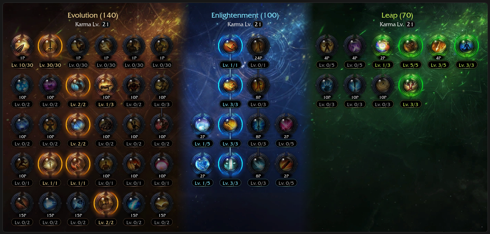
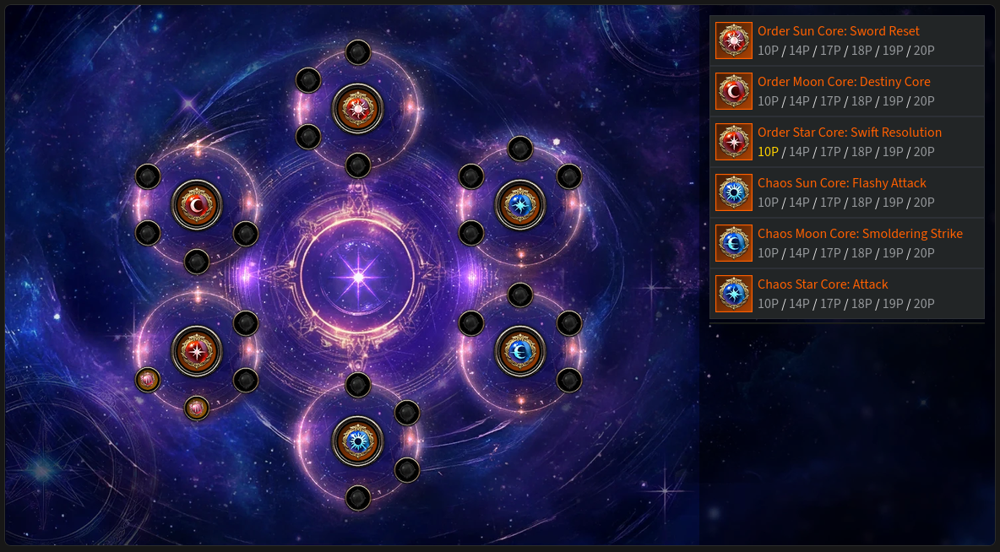
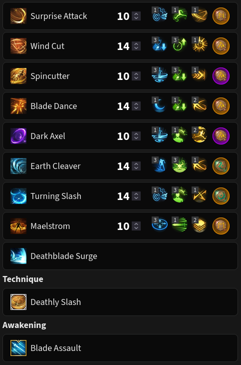
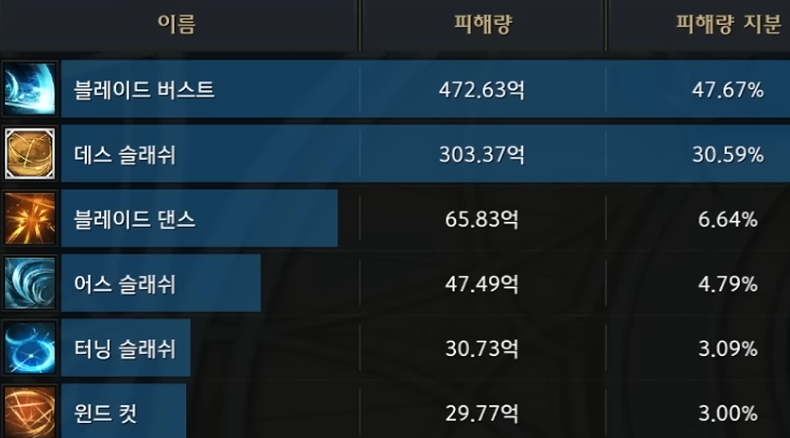

# 222 (Speedy) 🐆 NOT IN NA SERVERS YET

<div class="build-card" markdown>

<div class="build-stats">
<div class="stat"><span class="stat-label">Difficulty</span><span class="stat-value">7 / 10</span></div>
<div class="stat"><span class="stat-label">Trixion DPS</span><span class="stat-value">1.24 Multiplier</span></div>
<div class="stat"><span class="stat-label">Playstyle</span><span class="stat-value">Max Mobility</span></div>
</div>

**Best For:** Players who want something easy to pick up but difficult to master.

**Tradeoff:** Increased back attack stress and uptime requirements.

- Simple uptime-focused gameplay with no gimmicks.
- Highest mobility of all Deathblade builds by far.
- Counter is used in rotation, you must hold it when necessary.
- Very high gem efficiency, Surge and Deathly Slash are nearly all of your DPS.
- Must constantly balance Surge and Deathly Slash Back Attack rates with Surge CPM.

[KR Video Guide](https://www.youtube.com/watch?v=pzFa5zOuNik){ .video-chip } [KR Video Gameplay](https://www.youtube.com/watch?v=lbBLRwdEvgk){ .video-chip }

</div>

## Skill Codes

!!! danger "Before importing"
    Apply both "Ark Passive" and "Skill" to be safe. For [Gems](#gems), follow the guide.

=== "222 Speedy ⭐"

    ```
    0F5512B16D6B98BF848E17761E6E268E0C697EFF64D0DFBC464CB1EEA1C0EED282E9768BD1CBD8925E7EF1A397F319F846CCAF9C823948DD188BCC67E0E6D0BE
    ```

=== "Upper Slash"

    *Alternative skill setup that may be more comfortable for some.*

    ```
    TODO
    ```

## Ark Setup




!!! danger ""
    Deadly Feast and Dual Blade Dance cores don't exist in NA yet, so Sword Reset and Destiny core are used as placeholders. Playable with fewer chaos points, but it would be better to play [111 (Classic)](111-classic.md) instead.

!!! note "Adjustments"
    - Use the [DPS Calculator](https://docs.google.com/spreadsheets/d/1_0J7liyM_yw16pyn6TKlF1YGaIt5n_A9hSoLnT3yTUc/copy) to optimize Keen Sense/Limit Break and Master/Critical.
        - Keen Sense 2 + Master is usually best unless you have 2x crit rate synergy or 2x crit rate bracelet.
    - Release Potential 4 / Instant Spell 2 may be needed with +CD bracelet line (needs testing).

## Skill Setup



!!! tip "Rune Adjustments"
    - Use Legendary Purify on Spincutter if needed.
    - Use Epic Rage on Turning Slash if you prefer higher Rage uptime.

??? note "Skill Adjustments"
    - Upper Slash (2-3-2 tripods) can be used instead of Spincutter or Dark Axel.
    - Earth Explosion tripod on Earth Cleaver is up to personal preference.
        - Increased cast speed and extra stack, lowered mobility and damage.
    - Thick Sword Energy tripod increases Wind Cut range but builds less stacks.

??? example "Alternative skill setup: Upper Slash"
    - You can gain more comfort at a minor DPS loss by replacing Spincutter or Dark Axel for Upper Slash.
    - Upper Slash is a push immune skill that generates 5 stacks and allows you to skip Earth Cleaver casts.
        - Set Upper Slash to use 2-3-2 tripods and give it an Epic Galewind rune.
        - Lower Earth Cleaver's skill level to 10 and raise Upper Slash to level 14.
        - Replace both Earth Cleaver gems for Upper Slash CD and another gem of your liking.

!!! danger "Don't remove synergy from Turning Slash"
    Don't even think about it, the data is not in your favor.

## Gems

<div class="gem-priority" markdown>

<div class="gem-col gem-col-dmg" markdown>
**Damage** — *Prioritize Surge. Surge is everything.*

<div class="gem-row" markdown>
<span class="gem-chip"><span class="gem-num">1</span>  Surge</span>
<span class="gem-chip"><span class="gem-num">2</span>  Blade Dance</span>
<span class="gem-chip"><span class="gem-num">3</span>  Earth Cleaver</span>
<span class="gem-chip"><span class="gem-num">4</span>  Turning Slash</span>
<span class="gem-chip"><span class="gem-num">5</span>  Wind Cut</span>
</div>

You can replace Wind Cut damage for Dark Axel CD.

</div>

<div class="gem-col gem-col-cd" markdown>
**Cooldown** — *Playable with Lv 7s, ideally Lv 8s or higher.*

<div class="gem-row" markdown>
<span class="gem-chip"><span class="gem-num">1</span>  Wind Cut</span>
<span class="gem-chip"><span class="gem-num">2</span>  Surprise Attack</span>
<span class="gem-chip"><span class="gem-num">3</span>  Blade Dance</span>
<span class="gem-chip"><span class="gem-num">4</span>  Turning Slash</span>
<span class="gem-chip"><span class="gem-num">5</span>  Earth Cleaver</span>
<span class="gem-chip"><span class="gem-num">6</span>  Maelstrom</span>
</div>
</div>

</div>

## Rotation

There's an optimal skill order, but you have flexibility when facing downtime or weaving in mobility skills.

Use Spincutter and Dark Axel to guarantee back attacks on Deathly Slash and Surge.

'Destiny: Sharp Senses' can be stacked up to 5 times by using [Normal] skills to empower Deathly Slash.

Use the Main cycle and repeat it relentlessly until the encounter ends.

*From 3 orbs:*

=== "Main Cycle"

    <div class="rotation-line" markdown>
    <span class="skill">Wind Cut</span><span class="arrow"> → </span><span class="skill">Death Trance</span><span class="arrow"> → </span><span class="skill">Maelstrom</span><span class="arrow"> → </span><span class="skill">Surprise Attack</span><span class="arrow"> → </span><span class="skill">Wind Cut</span><span class="arrow"> → </span><span class="skill">Turning Slash</span><span class="arrow"> → </span><span class="skill">Earth Cleaver</span><span class="arrow"> → </span><span class="skill">Blade Dance</span><span class="arrow"> → </span><span class="skill">Deathly Slash</span><span class="arrow"> → </span><span class="skill">Surprise Attack</span><span class="arrow"> → </span><span class="skill">Surge</span>
    </div>

    - If you have to hold Earth Cleaver for counter, cast <span class="gem-chip">Spincutter</span> instead.

=== "Opener/Awakening Cycle"

    <div class="rotation-line" markdown>
    <span class="skill">Deathly Slash</span><span class="arrow"> → </span><span class="skill">Death Trance</span><span class="arrow"> → </span><span class="skill">Maelstrom</span><span class="arrow"> → </span><span class="skill">Surprise Attack</span><span class="arrow"> → </span><span class="skill">Wind Cut</span><span class="arrow"> → </span><span class="skill">Turning Slash</span><span class="arrow"> → </span><span class="skill">Blade Dance (Tap)</span><span class="arrow"> → </span><span class="skill">Blade Assault</span><span class="arrow"> → </span><span class="skill">Deathly Slash</span><span class="arrow"> → </span><span class="skill">Surge</span>
    </div>

    - Blade Dance is lightly tapped for a 'Destiny: Sharp Senses' stack.
    - If Blade Assault is on cooldown, finish up with a regular Main cycle.

=== "Upper Slash"

    <div class="rotation-line" markdown>
    <span class="skill">Wind Cut</span><span class="arrow"> → </span><span class="skill">Death Trance</span><span class="arrow"> → </span><span class="skill">Maelstrom</span><span class="arrow"> → </span><span class="skill">Surprise Attack</span><span class="arrow"> → </span><span class="skill">Wind Cut</span><span class="arrow"> → </span><span class="skill">Upper Slash</span><span class="arrow"> → </span><span class="skill">Turning Slash</span><span class="arrow"> → </span><span class="skill">Blade Dance</span><span class="arrow"> → </span><span class="skill">Deathly Slash</span><span class="arrow"> → </span><span class="skill">Surprise Attack</span><span class="arrow"> → </span><span class="skill">Surge</span>
    </div>

*From zero orbs:*

1. Use a Stimulant (recommended) or proceed to #2.
2. Generate one orb, build at least 40 stacks, then Surge to refill all 3 orbs.

??? example "Trixion DPS distribution"
    