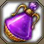

# 222 (Speedy) 🐆

<p class="page-banner page-banner-warning">Not available in NA/EU servers yet</p>

<div class="build-card-row" markdown>
<div class="build-card" data-updated="2026-08-07" markdown>

<div class="build-stats">
<div class="stat"><span class="stat-label">Difficulty</span><span class="stat-value">7 / 10</span><div class="stat-bar-track"><div class="stat-bar-fill" style="width: 70%"></div></div></div>
<div class="stat"><span class="stat-label">Trixion DPS</span><span class="stat-value">1.22 Multiplier</span><div class="stat-bar-track stat-bar-track-teal"><div class="stat-bar-fill stat-bar-fill-teal" style="width: 73%"></div></div></div>
<div class="stat"><span class="stat-label">Playstyle</span><span class="stat-value">Max Mobility</span></div>
</div>

**Best For:**{: .best-for } Players who want something easy to pick up but difficult to master.

**Tradeoff:**{: .tradeoff } Increased back attack stress and uptime requirements.

- Simple uptime-focused gameplay with no gimmicks.
- Highest mobility of all Deathblade builds by far.
- Counter is used in rotation, you must hold it when necessary.
- Very high gem efficiency, Surge and Deathly Slash are nearly all of your DPS.
- Must constantly balance Surge and Deathly Slash back attack rate with Surge CPM.

</div>
<!-- Build profile pentagon. Order: Difficulty, DPS, Mobility, Exposure, Speed (0-10).
     - DPS 8.5 = second-highest in the Surge family (111 Classic = 9 is
       the family's reference, standardized against 333 Ceiling in RE -
       see javascripts/pentagon-badge.js top comment).
     - Exposure (not Recovery) for Surge builds: back-attack/positional
       risk, HIGHER IS WORSE here unlike every other axis - keep the
       data-caption below in sync if you tweak this value.
     - Mobility/Speed are this build's own read - edit freely. -->
<div class="pentagon-badge" data-build="222-speedy" data-family="surge" markdown>
<div class="pentagon-badge-title">Build Profile</div>
<div class="pentagon-svg-mount"></div>
<div class="pentagon-badge-extra" markdown>
[Video Guide](https://www.youtube.com/watch?v=pzFa5zOuNik){ .video-chip } [Gameplay](https://www.youtube.com/watch?v=lbBLRwdEvgk){ .video-chip }
</div>
</div>
</div>

## Skill Codes

!!! danger "Before importing"
    Make sure you've read [Essentials](essentials.md), then apply both "Ark Passive" and "Skill" to be safe. For [Gems](#gems), follow the guide.

=== "222 Speedy ★"

    ```
    0F5512B16D6B98BF848E17761E6E268E0C697EFF64D0DFBC464CB1EEA1C0EED282E9768BD1CBD8925E7EF1A397F319F846CCAF9C823948DD188BCC67E0E6D0BE
    ```

=== "Upper Slash"

    *Alternative skill setup that may be more comfortable for some.*

    ```
    DCDFB3E872FB4DD3E910EFA0CAE35A3D30CDFB850D8280939B84BD32CBC8AA21D5F83501E60BDC9F1689AD68BA7FF12C867FFD1A6ED480726DE7CA09B38FEEA9
    ```

## Ark Setup

<div class="setup-panel" data-accent="lavender" markdown>

<div class="ark-passives" data-family="surge" markdown>
<script type="application/json">
{
  "columns": [
    { "id": "evolution", "label": "Evolution", "points": 140, "tiers": [
      { "label": "Tier 1", "nodes": [
        { "name": "Crit", "level": 10, "max": 30, "icon": "ap-icons/critical.png" },
        { "name": "Specialization", "level": 30, "max": 30, "icon": "ap-icons/specialization.png" }
      ] },
      { "label": "Tier 2", "nodes": [
        { "name": "Keen Sense", "level": 2, "max": 2, "icon": "ap-icons/keen-sense.png" },
        { "name": "Limit Break", "level": 1, "max": 3, "icon": "ap-icons/limit-break-evo.png" }
      ] },
      { "label": "Tier 3", "nodes": [
        { "name": "Strike", "level": 2, "max": 2, "icon": "ap-icons/strike.png" }
      ] },
      { "label": "Tier 4", "nodes": [
        { "name": "Master", "level": 1, "max": 1, "icon": "ap-icons/master.png" },
        { "name": "Pulverize", "level": 1, "max": 1, "icon": "ap-icons/pulverize.png" }
      ] },
      { "label": "Tier 5", "nodes": [
        { "name": "Standing Striker", "level": 2, "max": 2, "icon": "ap-icons/standing-striker.png" }
      ] }
    ] },
    { "id": "enlightenment", "label": "Enlightenment", "points": 100, "tiers": [
      { "label": "Tier 1", "nodes": [
        { "name": "Surge Enhancement", "level": 1, "max": 1, "icon": "ap-icons/surge-enhancement.png" }
      ] },
      { "label": "Tier 2", "nodes": [
        { "name": "Orb Compression", "level": 3, "max": 3, "icon": "ap-icons/orb-compression.png" }
      ] },
      { "label": "Tier 3", "nodes": [
        { "name": "Orb Control", "level": 1, "max": 5, "icon": "ap-icons/orb-control.png" },
        { "name": "Limit Break", "level": 3, "max": 3, "icon": "ap-icons/limit-break-enl.png" }
      ] },
      { "label": "Tier 4", "nodes": [
        { "name": "Chaos Infusion", "level": 1, "max": 5, "icon": "ap-icons/chaos-infusion.png" },
        { "name": "Chaotic Power", "level": 3, "max": 3, "icon": "ap-icons/chaotic-power.png" }
      ] }
    ] },
    { "id": "leap", "label": "Leap", "points": 70, "tiers": [
      { "label": "Tier 1", "nodes": [
        { "name": "Awakening Amplifier", "level": 1, "max": 3, "icon": "ap-icons/awakening-amplifier.png" },
        { "name": "Unleashed Power", "level": 5, "max": 5, "icon": "ap-icons/unleashed-power.png" },
        { "name": "Release Potential", "level": 3, "max": 5, "icon": "ap-icons/release-potential.png" },
        { "name": "Instant Spell", "level": 3, "max": 3, "icon": "ap-icons/instant-spell.png" }
      ] },
      { "label": "Tier 2", "nodes": [
        { "name": "Dance of Screams", "level": 3, "max": 3, "icon": "ap-icons/dance-of-screams.png" }
      ] }
    ] }
  ]
}
</script>
</div>

<div class="ark-cores" data-family="surge" markdown>
<script type="application/json">
[
  { "core": "sun", "label": "Deadly Feast", "points": 0 },
  { "core": "moon", "label": "Dual Blade Dance", "points": 0 },
  { "core": "star", "label": "Swift Resolution", "points": 1 }
]
</script>
</div>

<div class="setup-notes" markdown>

<details class="setup-note" data-kind="tip" open markdown>
<summary><span class="setup-note-tag">Tip</span>Ark Passive<span class="setup-note-arrow"></span></summary>

- Use the [Ark Passive Calculator](../resources.md#ark-passive-calculator) to optimize Evolution nodes.
- This build is capable of using Raid Captain + Mass Increase with the least drawbacks.

</details>

<details class="setup-note" data-kind="note" markdown>
<summary><span class="setup-note-tag">Note</span>Ark Grid<span class="setup-note-arrow"></span></summary>

- Damage and QoL will be lacking if you settle for the minimum core requirements.

</details>

</div>

</div>

## Skill Setup

<div class="setup-panel" data-accent="lavender" markdown>

<div class="skill-setup" data-family="surge" markdown>
<script type="application/json">
[
  {"id": "surpriseattack", "name": "Surprise Attack", "level": 10, "tripods": [1, 1, 1], "rune": {"tier": "legendary", "name": "Rage"}},
  {"id": "windcut", "name": "Wind Cut", "level": 14, "tripods": [3, 3, 1], "rune": {"tier": "legendary", "name": "Galewind"}},
  {"id": "spincutter", "name": "Spincutter", "level": 10, "tripods": [3, 3, 1], "rune": {"tier": "epic", "name": "Galewind"}},
  {"id": "bladedance", "name": "Blade Dance", "level": 14, "tripods": [1, 1, 2], "rune": {"tier": "legendary", "name": "Galewind"}},
  {"id": "darkaxel", "name": "Dark Axel", "level": 10, "tripods": [1, 1, 2], "rune": {"tier": "epic", "name": "Galewind"}},
  {"id": "earthcleaver", "name": "Earth Cleaver", "level": 14, "tripods": [3, 3, 1], "rune": {"tier": "legendary", "name": "Vision"}},
  {"id": "turningslash", "name": "Turning Slash", "level": 14, "tripods": [1, 3, 1], "rune": {"tier": "legendary", "name": "Poison"}},
  {"id": "maelstrom", "name": "Maelstrom", "level": 10, "tripods": [3, 1, 2], "rune": {"tier": "legendary", "name": "Focus"}},
  {"id": "deathtrance", "name": "Death Trance", "subtitle": "Identity"},
  {"id": "deathlyslash", "name": "Deathly Slash", "subtitle": "Technique"},
  {"id": "bladeassault", "name": "Blade Assault", "subtitle": "Awakening"},
  {"id": "surge", "name": "Surge", "subtitle": "Identity"}
]
</script>
</div>

<div class="setup-notes" markdown>

<details class="setup-note" data-kind="tip" open markdown>
<summary><span class="setup-note-tag">Tip</span>Runes<span class="setup-note-arrow"></span></summary>

- Use Legendary Purify on Spincutter if needed.
- Use Legendary Bleed on Surprise Attack if you prefer it.

</details>

<details class="setup-note" data-kind="note" markdown>
<summary><span class="setup-note-tag">Note</span>Optional<span class="setup-note-arrow"></span></summary>

- Earth Explosion tripod on Earth Cleaver is up to personal preference.
    - Increased cast speed and extra stack, lowered mobility and damage.
- Thick Sword Energy tripod increases Wind Cut range but builds less stacks.
- Head Hunt can be used instead of Earth Cleaver at a DPS loss if you prefer it.
- You can replace Spincutter or Dark Axel for literally any skill you prefer.

</details>

<details class="setup-note" data-kind="example" markdown>
<summary><span class="setup-note-tag">Alt</span>Upper Slash<span class="setup-note-arrow"></span></summary>

- You can gain more comfort at a DPS loss by replacing Spincutter or Dark Axel for Upper Slash.
- Upper Slash is a push immune skill that generates 5 stacks and allows you to skip Earth Cleaver casts.
- Replace both Earth Cleaver gems for Upper Slash CD and any other gem you prefer.
- Optionally, replace Earth Cleaver entirely for Lv 1-4 Head hunt and raise Surprise Attack.

<div class="skill-setup" data-family="surge" markdown>
<script type="application/json">
[
  {"id": "upperslash", "name": "Upper Slash", "level": 14, "tripods": [2, 3, 2], "rune": {"tier": "epic", "name": "Galewind"}},
  {"id": "earthcleaver", "name": "Earth Cleaver", "level": 10, "rune": {"tier": "legendary", "name": "Vision"}}
]
</script>
</div>

</details>

</div>

</div>

## Gems

<div class="setup-panel" data-accent="lavender" markdown>

<div class="gem-priority" markdown>

<div class="gem-col gem-col-dmg" markdown>
<div class="gem-col-header" markdown>
<span class="gem-col-title">Damage</span>
</div>

<div class="gem-list" markdown>
<div class="gem-item" data-rank="1" markdown>
<span class="gem-item-rank">1</span>
{: .gem-item-icon } <span class="gem-item-name">Surge</span>
</div>
<div class="gem-item" data-rank="2" markdown>
<span class="gem-item-rank">2</span>
{: .gem-item-icon } <span class="gem-item-name">Blade Dance</span>
</div>
<details class="gem-item gem-item-expandable" data-rank="3" markdown>
<summary markdown="span">
<span class="gem-item-rank">3</span>
{: .gem-item-icon } <span class="gem-item-name">Earth Cleaver</span>
<span class="gem-item-arrow"></span>
</summary>

<div class="gem-item-alts" markdown>

<div class="gem-alt" markdown>
{: .gem-alt-icon } **Upper Slash** — Optional in the Upper Slash build.
</div>
</div>

</details>
<div class="gem-item" data-rank="4" markdown>
<span class="gem-item-rank">4</span>
{: .gem-item-icon } <span class="gem-item-name">Turning Slash</span>
</div>
<details class="gem-item gem-item-expandable" data-rank="5" markdown>
<summary markdown="span">
<span class="gem-item-rank">5</span>
{: .gem-item-icon } <span class="gem-item-name">Wind Cut</span>
<span class="gem-item-arrow"></span>
</summary>

<div class="gem-item-alts" markdown>

<div class="gem-alt" markdown>
{: .gem-alt-icon } **Dark Axel** — Swap this to Dark Axel CD if you prefer.
</div>
</div>

</details>
</div>
</div>

<div class="gem-col gem-col-cd" markdown>
<div class="gem-col-header" markdown>
<span class="gem-col-title">Cooldown</span>
</div>

<div class="gem-list" markdown>
<div class="gem-item" data-rank="1" markdown>
<span class="gem-item-rank">1</span>
{: .gem-item-icon } <span class="gem-item-name">Wind Cut</span>
</div>
<div class="gem-item" data-rank="2" markdown>
<span class="gem-item-rank">2</span>
{: .gem-item-icon } <span class="gem-item-name">Surprise Attack</span>
</div>
<div class="gem-item" data-rank="3" markdown>
<span class="gem-item-rank">3</span>
{: .gem-item-icon } <span class="gem-item-name">Blade Dance</span>
</div>
<div class="gem-item" data-rank="4" markdown>
<span class="gem-item-rank">4</span>
{: .gem-item-icon } <span class="gem-item-name">Turning Slash</span>
</div>
<details class="gem-item gem-item-expandable" data-rank="5" markdown>
<summary markdown="span">
<span class="gem-item-rank">5</span>
{: .gem-item-icon } <span class="gem-item-name">Earth Cleaver</span>
<span class="gem-item-arrow"></span>
</summary>

<div class="gem-item-alts" markdown>

<div class="gem-alt" markdown>
{: .gem-alt-icon } **Upper Slash** — Required in the Upper Slash build.
</div>
</div>

</details>
<div class="gem-item" data-rank="6" markdown>
<span class="gem-item-rank">6</span>
{: .gem-item-icon } <span class="gem-item-name">Maelstrom</span>
</div>
</div>
</div>

</div>

</div>

## Rotation

There's an optimal skill order, but you have flexibility when facing downtime or weaving in mobility skills.

Use Spincutter and Dark Axel to guarantee back attacks on Deathly Slash and Surge.

'Destiny: Sharp Senses' can be stacked up to 5 times by using [Normal] skills to empower Deathly Slash.

Apply damage synergy if needed, then use the main cycle and repeat it relentlessly.

*From 3 orbs:*
{ .lead }

=== "Main Cycle"

    <div class="rotation-line" markdown>
    <span class="skill">Wind Cut</span><span class="arrow"> → </span><span class="skill">Death Trance</span><span class="arrow"> → </span><span class="skill">Maelstrom</span><span class="arrow"> → </span><span class="skill">Surprise Attack</span><span class="arrow"> → </span><span class="skill">Wind Cut</span><span class="arrow"> → </span><span class="skill">Turning Slash</span><span class="arrow"> → </span><span class="skill">Earth Cleaver</span><span class="arrow"> → </span><span class="skill">Blade Dance</span><span class="arrow"> → </span><span class="skill">Deathly Slash</span><span class="arrow"> → </span><span class="skill">Surprise Attack</span><span class="arrow"> → </span><span class="skill">Surge</span>
    </div>

    - Cast <span class="skill-chip">Spincutter</span> instead of <span class="skill-chip">Earth Cleaver</span> as needed.
    - Cast <span class="skill-chip">Blade Assault</span> whenever you want, I'm not your mom.
    - You don't strictly have to cast Wind Cut before Death Trance for this build.

=== "Upper Slash"

    *Main cycle for the Upper Slash skill setup.*
    { .lead }

    <div class="rotation-line" markdown>
    <span class="skill">Wind Cut</span><span class="arrow"> → </span><span class="skill">Death Trance</span><span class="arrow"> → </span><span class="skill">Maelstrom</span><span class="arrow"> → </span><span class="skill">Surprise Attack</span><span class="arrow"> → </span><span class="skill">Wind Cut</span><span class="arrow"> → </span><span class="skill">Upper Slash</span><span class="arrow"> → </span><span class="skill">Turning Slash</span><span class="arrow"> → </span><span class="skill">Blade Dance</span><span class="arrow"> → </span><span class="skill">Deathly Slash</span><span class="arrow"> → </span><span class="skill">Surprise Attack</span><span class="arrow"> → </span><span class="skill">Surge</span>
    </div>

    - Cast <span class="skill-chip">Blade Assault</span> whenever you want, I'm not your mom.
    - You don't strictly have to cast Wind Cut before Death Trance for this build.

*From zero orbs:*
{ .lead }

1. Use a {: .skill-icon } Stimulant (recommended) or proceed to #2.
2. Generate one orb, build at least 40 stacks, then Surge to refill all 3 orbs.

## DPS Spread

<div class="dps-showcase" markdown>
<div class="dps-showcase-frame" markdown>
<div class="dps-chart" data-icon-base="surge" data-labels="Surge,Deathly Slash,Blade Dance,Earth Cleaver,Turning Slash,Wind Cut" data-values="47.67,30.59,6.64,4.79,3.09,3"></div>
</div>
</div>