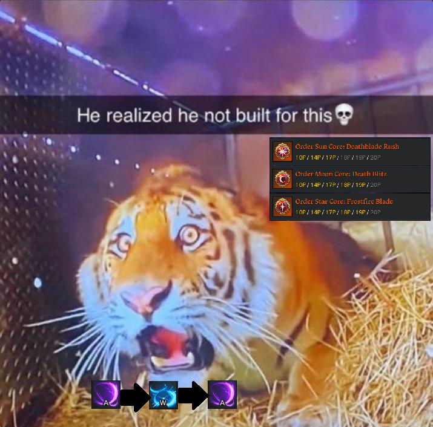
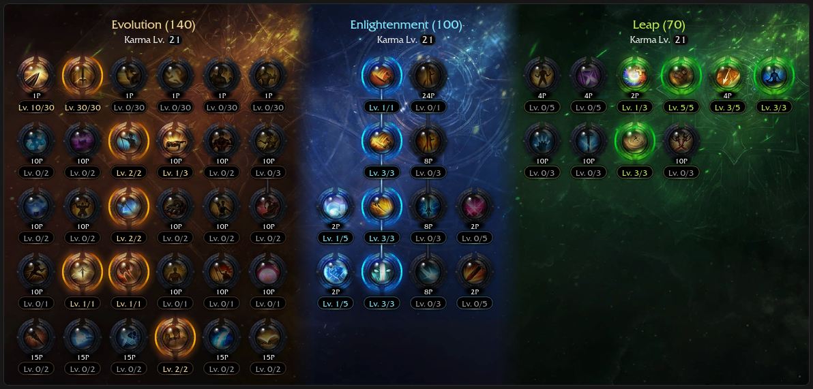
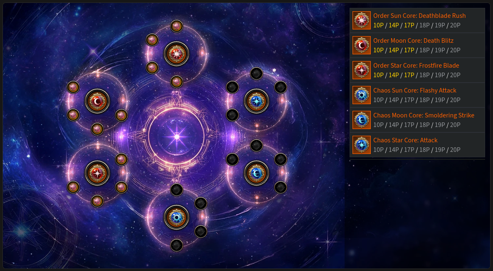
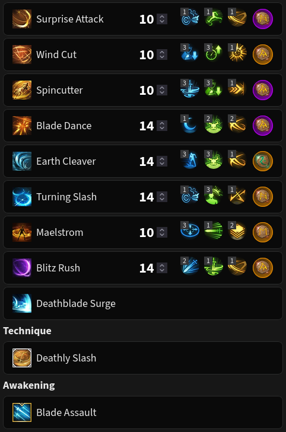
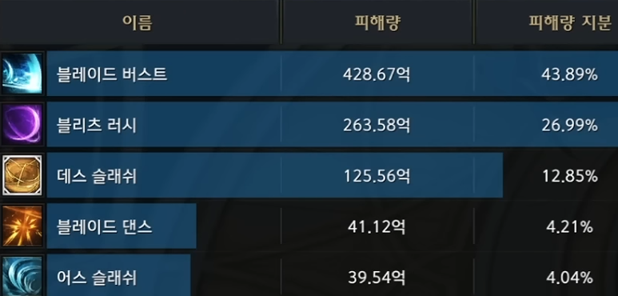

# 333 (Blitz) 🐯

<p class="page-banner page-banner-warning">Not available in NA servers yet</p>

<div class="build-card" markdown>

<div class="build-stats">
<div class="stat"><span class="stat-label">Difficulty</span><span class="stat-value">8 / 10</span><div class="stat-bar-track"><div class="stat-bar-fill" style="width: 80%"></div></div></div>
<div class="stat"><span class="stat-label">Trixion DPS</span><span class="stat-value">1.20? Multiplier</span><div class="stat-bar-track stat-bar-track-teal"><div class="stat-bar-fill-unconfirmed" style="width: 67%"></div></div></div>
<div class="stat"><span class="stat-label">Playstyle</span><span class="stat-value">Skill Reset</span></div>
</div>

**Best For:** Erm.

**Tradeoff:** The juice is not worth the squeeze.

- Uses Blitz Rush as two fast casts (BTB combo) via a skill reset.
- High gem efficiency, Surge and Blitz Rush are most of your DPS.
- Must balance Surge, Blitz Rush, and Deathly Slash back attack rate with Surge CPM.

[KR Video Guide](https://www.youtube.com/watch?v=pzFa5zOuNik){ .video-chip } [Exclusive NA Video Gameplay](../assets/surge/tiger.mp4){ .video-chip }

</div>

??? danger "🐯"
    

## Skill Codes

!!! danger "Before importing"
    Apply both "Ark Passive" and "Skill" to be safe. For [Gems](#gems), follow the guide.


=== "333 Blitz"

    ```
    99BD58624912EBBA0541BB2C16E16B2414D9FA6C556F53629FEB8DE2EA19F8A88692799FB7847B4E33257BC8D5A3480A36B6DE069816AB3CC2DEAC0F7570A7EF
    ```

## Ark Setup




!!! tip ""
    The minimum requirement to play this build is 14p Sun and 17p Moon, but damage will be lacking. 

!!! note "Adjustments"
    - Use the calculator you find easiest: [Arsonistic's](https://docs.google.com/spreadsheets/d/1_0J7liyM_yw16pyn6TKlF1YGaIt5n_A9hSoLnT3yTUc/edit?usp=sharing) or [KR's (Translated)](https://docs.google.com/spreadsheets/d/1RKpzg6sPNe7fuPDudJHAs0qbFukOwSyhMynDOijfoKY/edit?usp=sharing) to optimize Ark Passive.
        - Keen Sense 2 + Master is usually the best when using Keen Blunt Weapon.
        - If you don't use Keen Blunt Weapon, the above might not hold true so please learn to use the calculator!

## Skill Setup



!!! tip "Rune Adjustments"
    - Use Legendary Purify on Spincutter if needed.
    - Use Legendary Bleed or Poison instead of Rage if you don't use RC or MI engravings.

??? note "Skill Adjustments"
    - Earth Explosion tripod on Earth Cleaver is up to personal preference.
        - Increased cast speed and extra stack, lowered mobility and damage.
    - Thick Sword Energy tripod increases Wind Cut range but builds less stacks.
    - You can use the Quick Prep tripod on Blade Dance as a safety net.
    - Head Hunt can be used instead of Earth Cleaver at a DPS loss if you prefer it.

!!! danger "Don't remove synergy from Turning Slash"
    Don't even think about it, the data is not in your favor.

## Gems

<div class="gem-priority" markdown>

<div class="gem-col gem-col-dmg" markdown>
**Damage** — *Prioritize Surge. Surge is everything.*

<div class="gem-row" markdown>
<span class="gem-chip"><span class="gem-num">1</span>  Surge</span>
<span class="gem-chip"><span class="gem-num">2</span>  Blitz Rush</span>
<span class="gem-chip"><span class="gem-num">3</span>  Blade Dance</span>
<span class="gem-chip"><span class="gem-num">4</span>  Earth Cleaver</span>
<span class="gem-chip"><span class="gem-num">5</span>  Turning Slash</span>
</div>
</div>

<div class="gem-col gem-col-cd" markdown>
**Cooldown** — *Playable with Lv 7s, ideally Lv 8s or higher.*

<div class="gem-row" markdown>
<span class="gem-chip"><span class="gem-num">1</span>  Wind Cut</span>
<span class="gem-chip"><span class="gem-num">2</span>  Blitz Rush</span>
<span class="gem-chip"><span class="gem-num">3</span>  Blade Dance</span>
<span class="gem-chip"><span class="gem-num">4</span>  Surprise Attack</span>
<span class="gem-chip"><span class="gem-num">5</span>  Maelstrom</span>
<span class="gem-chip"><span class="gem-num">6</span>  Earth Cleaver</span>
</div>
</div>

</div>

## Rotation

There's an optimal skill order, but you have flexibility when facing downtime or weaving in mobility skills.

Spincutter is your main mobility skill and backup stack builder. Use it to guarantee back attacks on your major skills.

Apply damage synergy if needed, then use the main cycle and repeat it as best you can.

*From 3 orbs:*
{ .lead }

=== "Main Cycle"

    <div class="rotation-line" markdown>
    <span class="skill">Wind Cut</span><span class="arrow"> → </span><span class="skill">Death Trance</span><span class="arrow"> → </span><span class="skill">Maelstrom</span><span class="arrow"> → </span><span class="skill">Surprise Attack</span><span class="arrow"> → </span><span class="skill">Wind Cut</span><span class="arrow"> → </span><span class="skill">Earth Cleaver</span><span class="arrow"> → </span><span class="skill">Blade Dance</span><span class="arrow"> → </span><span class="skill">Deathly Slash</span><span class="arrow"> → </span><span class="skill">Blitz Rush</span><span class="arrow"> → </span><span class="skill">Turning Slash</span><span class="arrow"> → </span><span class="skill">Blitz Rush</span><span class="arrow"> → </span><span class="skill">*(  Surprise Attack — situational )*</span><span class="arrow"> → </span><span class="skill">Surge</span>
    </div>

    - You can skip the final Surprise Attack when you have excess stacks.
    - Consider delaying Maelstrom by 1 to 3 skills when uptime drops to ensure it covers Surge.

=== "Awakening Cycle"

    <div class="rotation-line" markdown>
    <span class="skill">Wind Cut</span><span class="arrow"> → </span><span class="skill">Death Trance</span><span class="arrow"> → </span><span class="skill">Maelstrom</span><span class="arrow"> → </span><span class="skill">Surprise Attack</span><span class="arrow"> → </span><span class="skill">Wind Cut</span><span class="arrow"> → </span><span class="skill">Blade Assault</span><span class="arrow"> → </span><span class="skill">Deathly Slash</span><span class="arrow"> → </span><span class="skill">Turning Slash</span><span class="arrow"> → </span><span class="skill">Blitz Rush</span><span class="arrow"> → </span><span class="skill">Surge</span>
    </div>

    - Needs testing when the update arrives to NA.

*From zero orbs:*
{ .lead }

1. Use a {: .skill-icon } Stimulant (recommended) or proceed to #2.
2. Generate one orb, build at least 40 stacks, then Surge to refill all 3 orbs.

??? example "Trixion DPS distribution"
    