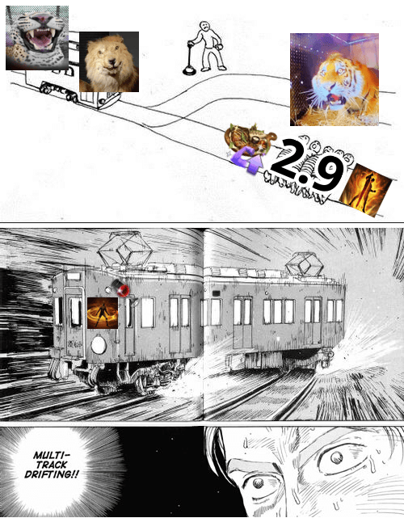

# 333 (Blitz) <span class="tiger-emoji" title="rawr">🐯</span>

<p class="page-banner page-banner-warning">Not available in NA/EU servers yet, rotations subject to change</p>

<div class="build-card-row" markdown>
<div class="build-card" data-updated="2026-08-07" markdown>

<!-- Difficulty/Trixion/Playstyle stats above, AND the pentagon badge below,
     both read from javascripts/build-data.js (window.DB_BUILD_DATA) - there is
     nothing to hand-edit in either div itself. Find this build by its
     data-build id there and edit pentagon/difficulty/trixion/bestFor/etc.;
     the stat row, the pentagon badge, and the essentials.md comparison table
     all update together from that one place. -->
<div class="build-stats" data-build="333-blitz" data-family="surge"></div>

**Best For:**{: .best-for } Erm.

**Tradeoff:**{: .tradeoff } The juice is not worth the squeeze.

- Uses Blitz Rush as two fast casts (BTB combo) via a skill reset.
- High gem efficiency, Surge and Blitz Rush are most of your DPS.
- Must balance Surge, Blitz Rush, and Deathly Slash back attack rate with Surge CPM.

</div>
<div class="pentagon-badge" data-build="333-blitz" data-family="surge" markdown>
<div class="pentagon-badge-title">Build Profile</div>
<div class="pentagon-svg-mount"></div>
<div class="pentagon-badge-extra" markdown>
[Video Guide](https://www.youtube.com/watch?v=pzFa5zOuNik){ .video-chip } [Gameplay](../assets/tiger.mp4){ .video-chip }
</div>
</div>
</div>

<div class="setup-panel" data-accent="lavender" markdown>
<div class="setup-notes" markdown>

<details class="setup-note" data-kind="note" markdown>
<summary><span class="setup-note-tag">Note</span>But why male models? 🐯<span class="setup-note-arrow"></span></summary>

{ .setup-note-image .zoomable-image loading=lazy }

</details>

</div>
</div>

## Skill Codes

<!-- Paste the exported skill-code string (from the in-game loadout share
     feature) into the fenced code block below. Each `=== "Tab Name"` block is
     a separate tab holding its own code + optional italic note above it -
     copy that pattern to add another import option (e.g. an easier variant). -->

<div class="setup-panel" data-accent="lavender" markdown>
<div class="setup-notes" markdown>

<details class="setup-note" data-kind="danger" open markdown>
<summary><span class="setup-note-tag">Warn</span>Before Importing<span class="setup-note-arrow"></span></summary>

Make sure you've read [Essentials](essentials.md), then apply both "Ark Passive" and "Skill" to be safe. For [Gems](#gems), follow the guide.

</details>

</div>
</div>

=== "333 Blitz"

    ```
    11B831CEAE79C01924EB6CC424D1B22A2079A4E7E9C890255317EA3E47347FCB0692F007FB2EAE9C66A610B68FA04D141E320165FEF5D3674C32FBDB94249C4A
    ```

## Ark Setup

<!-- ark-passives / ark-cores JSON below use the site-wide node/core id
     vocabulary - full schema (node ids, tier shape, points) is documented in
     javascripts/ark-passive-tree.js and ark-core-badge.js's "EASY EDIT GUIDE"
     comments. A nested "Alt" details block (e.g. an easier/optional variant)
     can carry its own compact ark-passives/skill-setup pair for that
     alternative - copy the existing pattern rather than editing the main
     tree in place. -->

<div class="setup-panel" data-accent="lavender" markdown>

<div class="ark-passives" data-family="surge" markdown>
<script type="application/json">
[
    { "id": "evolution", "label": "Evolution", "points": 140, "tiers": [
      { "label": "Tier 1", "nodes": [
        { "id": "crit", "level": 10, "max": 30 },
        { "id": "specialization", "level": 30, "max": 30 }
      ] },
      { "label": "Tier 2", "nodes": [
        { "id": "keensense", "level": 2, "max": 2 },
        { "id": "limitbreakevo", "level": 1, "max": 3 }
      ] },
      { "label": "Tier 3", "nodes": [
        { "id": "strike", "level": 2, "max": 2 }
      ] },
      { "label": "Tier 4", "nodes": [
        { "id": "master", "level": 1, "max": 1 },
        { "id": "pulverize", "level": 1, "max": 1 }
      ] },
      { "label": "Tier 5", "nodes": [
        { "id": "standingstriker", "level": 2, "max": 2 }
      ] }
    ] },
    { "id": "enlightenment", "label": "Enlightenment", "points": 100, "tiers": [
      { "label": "Tier 1", "nodes": [
        { "id": "surgeenhancement", "level": 1, "max": 1 }
      ] },
      { "label": "Tier 2", "nodes": [
        { "id": "orbcompression", "level": 3, "max": 3 }
      ] },
      { "label": "Tier 3", "nodes": [
        { "id": "orbcontrol", "level": 2, "max": 5 },
        { "id": "limitbreakenl", "level": 3, "max": 3 }
      ] },
      { "label": "Tier 4", "nodes": [
        { "id": "chaoticpower", "level": 3, "max": 3 }
      ] }
    ] },
    { "id": "leap", "label": "Leap", "points": 70, "tiers": [
      { "label": "Tier 1", "nodes": [
        { "id": "awakeningamplifier", "level": 1, "max": 3 },
        { "id": "unleashedpower", "level": 5, "max": 5 },
        { "id": "releasepotential", "level": 3, "max": 5 },
        { "id": "instantspell", "level": 3, "max": 3 }
      ] },
      { "label": "Tier 2", "nodes": [
        { "id": "danceofscreams", "level": 3, "max": 3 }
      ] }
    ] }
  ]
</script>
</div>

<div class="ark-cores" data-family="surge" markdown>
<script type="application/json">
[
  { "core": "sun", "label": "Deathblade Rush", "points": 2 },
  { "core": "moon", "label": "Death Blitz", "points": 3 },
  { "core": "star", "label": "Frostfire Blade", "points": 0 }
]
</script>
</div>

<div class="setup-notes" markdown>

<details class="setup-note" data-kind="tip" open markdown>
<summary><span class="setup-note-tag">Tip</span>Ark Passive<span class="setup-note-arrow"></span></summary>

- Use the [Ark Passive Calculator](../resources.md#ark-passive-calculator) to optimize Evolution nodes.

</details>

<details class="setup-note" data-kind="note" markdown>
<summary><span class="setup-note-tag">Note</span>Ark Grid<span class="setup-note-arrow"></span></summary>

- Damage will be lacking if you settle for the minimum core requirements.

</details>

</div>

</div>

## Skill Setup

<!-- Full skill-setup schema (id/level/tripods/rune/subtitle/picks) is in
     javascripts/skill-setup.js's "EASY EDIT GUIDE" comment. Names, icons, and
     tags resolve automatically by id from skill-data.js - only add "name" to
     override the display text for a genuine one-off case. -->

<div class="setup-panel" data-accent="lavender" markdown>

<div class="skill-setup" data-family="surge" markdown>
<script type="application/json">
[
  {"id": "surpriseattack", "level": 10, "tripods": [1, 1, 1], "rune": {"tier": "epic", "name": "Rage"}},
  {"id": "windcut", "level": 10, "tripods": [3, 3, 1], "rune": {"tier": "legendary", "name": "Galewind"}},
  {"id": "spincutter", "level": 10, "tripods": [3, 3, 1], "rune": {"tier": "epic", "name": "Galewind"}},
  {"id": "bladedance", "level": 14, "tripods": [1, 2, 2], "rune": {"tier": "epic", "name": "Galewind"}},
  {"id": "earthcleaver", "level": 14, "tripods": [3, 3, 1], "rune": {"tier": "legendary", "name": "Vision"}},
  {"id": "turningslash", "level": 14, "tripods": [1, 3, 1], "rune": {"tier": "legendary", "name": "Rage"}},
  {"id": "maelstrom", "level": 10, "tripods": [3, 1, 2], "rune": {"tier": "legendary", "name": "Focus"}},
  {"id": "blitzrush", "level": 14, "tripods": [2, 1, 1], "rune": {"tier": "legendary", "name": "Galewind"}},
  {"id": "deathtrance", "subtitle": "Identity"},
  {"id": "deathlyslash", "subtitle": "Technique"},
  {"id": "bladeassault", "subtitle": "Awakening"},
  {"id": "surge", "subtitle": "Identity"}
]
</script>
</div>

<div class="setup-notes" markdown>

<details class="setup-note" data-kind="tip" open markdown>
<summary><span class="setup-note-tag">Tip</span>Runes<span class="setup-note-arrow"></span></summary>

- Use Legendary Purify on Spincutter if needed.
- Use Legendary Bleed or Poison instead of Rage if you don't use RC or MI engravings.
    - Each one is about 0.75% DPS in exchange for lower or no Rage buff uptime.
    - Give the Bleed/Poison to Maelstrom and Turning Slash if you use mana food.

</details>

<details class="setup-note" data-kind="note" markdown>
<summary><span class="setup-note-tag">Note</span>Optional<span class="setup-note-arrow"></span></summary>

- You can use the Quick Prep tripod on Blade Dance at lower gem levels.
- Earth Explosion tripod on Earth Cleaver is up to personal preference.
    - Increased cast speed, but greatly lowers mobility and damage.
- Thick Sword Energy tripod increases Wind Cut range but builds less stacks.
- Head Hunt can be used instead of Earth Cleaver at a DPS loss if you prefer.

</details>

</div>

</div>

## Gems

<!-- Ranked skill-id lists per column (dmg/cd), top = highest priority.
     Full schema, including the expandable "alts" form for a swappable
     alternative, is in javascripts/gem-priority.js's "EASY EDIT GUIDE"
     comment. -->

<div class="setup-panel" data-accent="lavender" markdown>

<div class="gem-priority" markdown>
<script type="application/json">
[
  { "col": "dmg", "label": "Damage", "items": [
    "surge", "blitzrush", "bladedance", "earthcleaver", "turningslash"
  ] },
  { "col": "cd", "label": "Cooldown", "items": [
    "windcut", "blitzrush", "bladedance", "surpriseattack", "maelstrom", "earthcleaver"
  ] }
]
</script>
</div>

</div>

## Rotation

<!-- Each `.rotation-line` is a compact JSON step list of skill ids in
     order - names/icons resolve automatically, same id vocabulary as Skill
     Setup and Gems above. Full schema (situational steps, swapNext,
     cycleRef, trailing suffix, etc.) is in javascripts/rotation-line.js's
     "EASY EDIT GUIDE" comment. -->

There's an optimal skill order, but you have flexibility when facing downtime or weaving in mobility skills.

Spincutter is your main mobility skill and backup stack builder. Use it to guarantee back attacks on your major skills.

Apply damage synergy if needed, then repeat the rotation cycle as best you can.

*From 3 orbs:*
{ .lead }


<div class="rotation-line" markdown>
<script type="application/json">
["windcut", "deathtrance", "maelstrom", "surpriseattack", "windcut", "earthcleaver", "bladedance", "deathlyslash", "blitzrush", "turningslash", "blitzrush",
{ "id": "surpriseattack", "situational": true },
"surge"]
</script>
</div>

1. Consider delaying Maelstrom by 1 to 3 skills when uptime drops to ensure it covers Surge.

<div class="setup-panel" data-accent="lavender" markdown>
<div class="setup-notes" markdown>

<details class="setup-note" data-kind="example" markdown>
<summary><span class="setup-note-tag">Alt</span>🐯 Mode (Optional)<span class="setup-note-arrow"></span></summary>
{ .setup-note-image .zoomable-image loading=lazy }
</details>

</div>
</div>

*From zero orbs:*
{ .lead }

1. Use a {: .skill-icon } Stimulant (recommended) or proceed to #2.
2. Generate one orb, build at least 40 stacks, then Surge to refill all 3 orbs.

## DPS Spread

<!-- data-labels / data-values / data-ids are three parallel comma-separated
     lists, ordered highest % first - update after a fresh Trixion recording
     or a balance pass. Full schema is in javascripts/dps-chart.js's
     "EASY EDIT GUIDE" comment. -->

<div class="dps-showcase" markdown>
<div class="dps-showcase-frame" markdown>
<div class="dps-chart" data-show-icons data-labels="Surge,Blitz Rush,Deathly Slash,Blade Dance,Earth Cleaver" data-values="43.89,26.99,12.85,4.21,4.04" data-ids="surge,blitzrush,deathlyslash,bladedance,earthcleaver"></div>
</div>
</div>