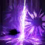

# Essentials

??? danger "Upcoming (September Balance Patch)"
    - Death Trance no longer auto-deactivates mid-stack via a side node.
    - Stack cap increased from 60 to 80. Extra stacks now roll over.
    - Breaking Moon changes to a Normal skill and gives 60 stacks on hit.
    - Complete rework of 222 cores and playstyle. It's actually good now.
    - Blitz Rush gains a 27% cast speed tripod and 20% more attack range.
    - Turning Slash and Surprise Attack's after-effects now also apply Synergy.
    - Overall damage increases, Surge is now competitive with RE.
    - Surge post-cast delay was removed, animation cancelling is no longer needed.

!!! tip "Quick Tips"
    - Always press the next skill during your current skill's animation (skill queuing).
    - Trixion practice requires equipping maxed Spirit Absorption and Max MP engravings.
    - The Bartender on Peyto Island sells {: .skill-icon } Vernese Wine and {: .skill-icon } Ealyn's Blessing.
    - Optimized Training 1 may help smooth things out at lower gem levels.

## Build Comparison

*Note: Trixion DPS is just a dummy test. Real raid performance is what actually matters!*

| Build | Difficulty | Trixion DPS | Playstyle | Best For |
|:---|:---:|:---:|:---|:---|
| [111 (Classic)](111-classic.md) ★ | 
7.5 / 10

 | 
1.23x

 | Burst Combo | 🦁 Classic Surge gameplay |
| [222 (Speedy)](222-speedy.md) | 
7 / 10

 | 
1.22x

 | Max Mobility | 🐆 Simple uptime focus |
| [333 (Blitz)](333-blitz.md) | 
8 / 10

 | 
1.20x

 | Skill Reset | 🐯 Waiting for buffs |

## Engravings

| Category | Options |
|---|---|
| Engravings | Grudge · Adrenaline · Ambush Master |
| Choose Two | Raid Captain ★ · Keen Blunt Weapon ★ · Mass Increase · Cursed Doll |

-   **Raid Captain** ★

    ---

    {: .skill-icon } Atk/Move Speed feast + {: .skill-icon } Vernese Wine is **required**
    { .food-req }

    May require additional Maelstrom management.

-   **Keen Blunt Weapon** ★

    ---

    A safe and efficient choice
    { .food-req }

    Pair this with Cursed Doll if you're a newer player.

-   **Mass Increase**

    ---

    {: .skill-icon } Atk/Move Speed feast + {: .skill-icon } Ealyn's Blessing is **required**
    { .food-req }

    May require additional Maelstrom management and player skill. Fewer drawbacks for [222 (Speedy)](222-speedy.md) 🐆

-   **Raid Captain + Mass Increase**

    ---

    {: .skill-icon } Vernese Wine with Bard or Paladin
    { .food-req }

    {: .skill-icon } Ealyn's Blessing with Artist or Valkyrie
    { .food-req }

    If you can handle the drawbacks, this is ceiling.

## Gameplay

**Identity**

- Orb Generation: Death Trance orbs fill as normal skills land.
- Death Trance Activation: Press [Z] with 1 or more orbs to enter Death Trance.
- You can gain up to 80 stacks while in Death Trance mode.
- After using Surge, 60 stacks are consumed and the rest will roll over.
- You must use Surge with at least 40 stacks to refund all 3 orbs.

**Death Trance Buffs (scale with orb count)**

- 10/15/20% Attack Speed.
- 10% Move Speed.
- 8/16/24% Attack Power.
- 15/25/45% Mana Restoration.
- 10/30/50% Cooldown Reduction on activation.

**Party Synergies**

- Turning Slash and Surprise Attack grant +4% outgoing and +5% directional dmg for 12 and 6 seconds on hit.
- Maelstrom grants +12.8% Attack/Move Speed for 6 seconds on skill use.

**Playstyle Goals**

Build Surge stacks to 60 using multi-hit skills while in Death Trance, then cast Surge as a back attack and repeat as many times as possible until the encounter ends.

**Combat Performance Metric: CPM (Casts Per Minute)**

If you want to gauge your skill level, the best metric to look at is your Surge CPM. Make sure to only compare performances across the exact same encounter and build.

## Surge Skills

| | Skill | Tags | Notes |
|---|---|---|---|
|  | **Wind Cut** *up to 8-9 stacks* | STACKSNOT PARALYSIS IMMUNE | Usually cast before Death Trance |
|  | **Death Trance** | BUFFDESTINYPUSH IMMUNE | Grants buffs and skill CDR |
|  | **Maelstrom** *up to 7 stacks* | SYNERGYBUFFNOT PARALYSIS IMMUNE | Increases Attack/Move Speed, charges up to two stacks |
|  | **Surprise Attack** *up to 7 stacks* | SYNERGYMOBILITYWEAK POINT | Applies +4% outgoing and +5% directional damage synergy on hit |
|  | **Breaking Moon** *60 stacks* | DAMAGESTACKSBUFF | Grants 60 stacks on hit and empowers the next Surge with +60% Critical Damage |
|  | **Surge** | DAMAGEPUSH IMMUNE | Consumes 60 stacks to deal maximum damage |
|  | **Blade Dance** *up to 9 stacks* | STACKSDAMAGE | You can stop holding it about 90% of the way and still generate full stacks |
|  | **Blitz Rush** *up to 7 stacks* *or 1 stack 🐯* | DAMAGE | Skill reset and damage for 🐯 |
|  | **Earth Cleaver** *2 to 3 stacks* | COUNTERMOBILITYWEAK POINTNOT PARALYSIS IMMUNE | Charges up to two stacks for 🦁 |
|  | **Spincutter** *2 stacks* *per cast* | MOBILITYSTACKS | Can be cast up to 3 times, backup stack builder |
|  | **Turning Slash** *up to 5 stacks* | SYNERGYDESTINYPUSH IMMUNE | Applies +4% outgoing and +5% directional damage synergy on hit, destiny activator for 🐯 |
|  | **Blade Assault** *up to 20 stacks* | AWAKENINGDAMAGEPUSH IMMUNESTATUS IMMUNE | Hold fully for maximum damage |
|  | **Deathly Slash** *up to 8-12 stacks* | DAMAGEMOBILITY | Empowered for 🐆 |
|  | **Dark Axel** *2 to 3 stacks* | MOBILITYPUSH IMMUNE | Jumps over bosses to ensure a back attack |
|  | **Upper Slash** *up to 5 stacks* | PUSH IMMUNE | Alternative skill for 🐆 |
|  | **Fallstar** *up to 8 stacks* | PUSH IMMUNE | *Surely one day this is meta...* |

Damage
Utility
Immune
Warning

